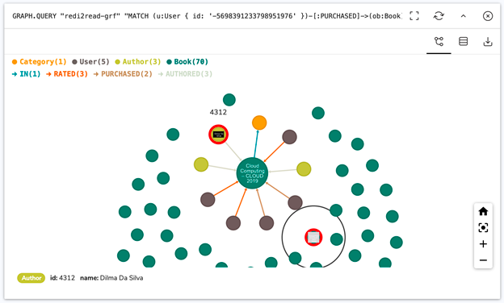

# RedisConf 2021

Workshop
Introductions
# Redis and Spring: Building High Performance RESTful APIs


## INTRODUCTIONS


Brian Sam-Bodden (bsb@redislabs.com)
Andrew Brookins (andrew.brookins@redislabs.com)
.

Welcome to Redis and Spring: Building High Performance REST APIs. I'm Brian Sam-Bodden, Developer Advocate at Redis Labs. My teaching assistant for this course is the illustrious Andrew Brookins, who you may recognize from our Redis University YouTube channel.

In this course, you'll learn about building REST Services with Spring and Redis through a blend of video and text-based training. The course is delivered in a tutorial style, in which you can follow along with the video and build the course’s sample application along with the instructor.

...And don’t worry if you get stuck during any lesson. The sample project provides milestones in the form of Git branches that can help you pick up the project at any specific lesson.

## LEARNING OBJECTIVES


By following the materials in this course, you can expect to learn about:
- Creating a Spring Boot Application configured to use Redis
- Downloading, launching, and testing a Redis Instance
- Working with Spring Data Redis templates
- Mapping domain objects with Spring Data Redis
- Loading JSON data with Jackson and using CommandLineRunners to seed Redis
- Working with Redis repositories
- Implementing pagination on a Redis-backed domain
- Enhancing your domain models with RedisJSON
- Implementing full-text search, faceted search, and auto-complete with RediSearch
- Implementing a recommendation service with RedisGraph
- Producing and consuming streaming data with Redis Streams
- Efficiently maintaining a leaderboard with RedisBloom
- Caching REST services with Redis
- Securing REST services with JWT Token Security in a Redis environment

## PRE-REQUISITES


To get the most from this course, you'll need a machine that can run the application and the Redis server, which is provided as a Docker container.

You'll also need the following installed on your machine:
- Git: See https://git-scm.com/
- Java 11 or higher: I recommend SDKMAN to install Java (https://sdkman.io/)
- Maven 3.2+: See https://sdkman.io/sdks#maven
- Docker: See https://docs.docker.com/get-docker/
- Docker Compose: See https://docs.docker.com/compose/install/
- Postman or Curl: See https://www.postman.com/ / Curl is built-in on most platforms (for Windows see https://curl.se/windows/)
- Your favorite IDE or Code Editor (such as VSCode, Eclipse or IntelliJ IDEA)


## LET’S LEARN TOGETHER


We're here to support your learning through a dedicated Discord channel that I'll be monitoring along with other teaching assistants. Join us on the Redis Discord server. When you enter the server, type:

Spring and Redis: Up and Running
Spring and Redis: Up and Running


Brian Sam-Bodden (bsb@redislabs.com)
Andrew Brookins (andrew.brookins@redislabs.com)


## OBJECTIVES


Create the skeleton for the course’s Spring Boot application, configuring all dependencies and launching a suitably configured Redis instance for the course.

## AGENDA

In this lesson, you will learn:
- How to create and configure your Spring Boot application to use Redis
- How to add a docker-compose file as a Git submodule to your application to configure and run Redis
- How to add a Git submodule with the application’s sample raw data
- How to launch a Redis instance suitable for the course
  If you get stuck:
- The progress made in this lesson is available on the redi2read github repository at https://github.com/redis-developer/redi2read/tree/course/milestone-1



## CREATING A SKELETON SPRING BOOT APPLICATION FROM SCRATCH!


If you want to start with a fully configured Spring Boot application and wish to skip the “from scratch” part, skip to the section “Quick Start For Those In a Hurry.”

1. In your browser, launch the Spring Initilizr
2. Fill out the form using the following settings:
- Project: Maven Project
- Language: Java
- Spring Boot: 2.4.4
- Project Metadata:
  Group: com.redislabs.edu
  Artifact: redi2read
  Name: redi2read
  Description: Bookstore Web Services Powered by Redis
  Package Name: com.redislabs.edu.redi2read
  Packaging: JAR
  Java: 11
- Dependencies:
  Spring Web
  String Data Redis (Access + Driver)
  Spring Security
  Lombok
  Spring Boot DevTools

Alternatively, you can use the following URL: http://bit.ly/spring-initlz-redi2read to launch the Spring Initilizr fully configured for the project.

Click on GENERATE and Initializr will generate the zip file for the project and prompt you to download it to your local machine.

Unzip the downloaded file (named redi2read.zip) in a suitable directory. For example on a Mac:


cd ~/my-directory

unzip ~/Downloads/redi2read.zip


## ADDING REDISMOD-DOCKER-COMPOSE GIT SUBMODULE


Now that you have downloaded and unzipped the generated Spring Initializr application, change directories to the app directory (./redi2read) and inspect the contents.

You should have a full Maven-based Spring Boot application. Since we are going to be adding submodules, let’s put the application in git:

```
echo "# redi2read" >> README.md

git init

git commit --allow-empty -m "git: initial empty commit"

git add README.md

git commit -m "feat: spring boot + redis initializr app"

git branch -M main
```

In the previous code block we initialized a git repo in our redi2read application directory. Adding an empty git commit facilitates future Git rebase operations.

Now that we have a basic Spring application, we need to configure a Redis instance for our application.

We've created a docker-compose file in a git repository that you can add as a submodule to your application.

Git submodules, if you haven't encountered them, are a way to nest a git repo within another git repo. Read the Git documentation on submodules to learn more.

You’ll find this file in the redismod-docker-compose repo, hosted under the redis-developer organization in Github.

The Repo contains a Docker Compose file configured to use the Redis Labs “redismod” image, which is a Docker image that includes Redis built with select Redis Labs modules. In particular, we will use the RedisJSON, RediSearch, and RedisGraph modules while building this application.

Modules included in the container:

- RediSearch: a full-featured search engine
- RedisGraph: a graph database
- RedisTimeSeries: a time-series database
- RedisAI: a tensor and deep learning model server
- RedisJSON: a native JSON data type
- RedisBloom: native Bloom and Cuckoo Filter data types
- RedisGears: a dynamic execution framework

To add the submodule, we use the git submodule command at the root of the project:

git submodule add git@github.com:redis-developer/redismod-docker-compose.git docker


The command adds the contents of the passed repository under the folder named “docker,” which the command will create.

At this point you can commit the changes made to the repository.

## ADDING REDI2READ-DATA GIT SUBMODULE


The sample data for the application is also provided as a separate Git repo that we will add to our main repository: redi2read-data.

The raw data for our application consists of a collection of JSON documents, representing books and users.

Books


The collection of JSON documents for book data comes from https://books.googleapis.com. Each file is labelled with the keyword/category used to construct it and an incrementing integer (some categories have more books than others) resulting in JSON such as:
```
{

"pageCount":304,

"thumbnail":"http:\/\/books.google.com\/books\/content?id=prtSDwAAQBAJ&printsec=frontcover&img=1&zoom=1&edge=curl&source=gbs_api",

"price":42.99,

"subtitle":null,

"description":"Drowning in unnecessary complexity, unmanaged state, and tangles of spaghetti code? In the best tradition of Lisp, Clojure gets out of your way so you can focus on expressing simple solutions to hard problems.",

"language":"en",

"currency":"USD",

"id":"1680505726",

"title":"Programming Clojure",

"infoLink":"https:\/\/play.google.com\/store\/books\/details?id=prtSDwAAQBAJ&source=gbs_api",

"authors":[

"Alex Miller",

"Stuart Halloway",

"Aaron Bedra"

]

}
```

We have an ID (the book ISBN), title, subtitle, description, page count, price, currency, language, thumbnail URL, a link to more information (the “infoLink” field), and an array of authors.


Users

The user data was randomly created using https://randomuser.me, which generated JSON like:
```
{

"password": "9yNvIO4GLBdboI",

"name": "Georgia Spencer",

"id": -5035019007718357598,

"email": "georgia.spencer@example.com"

}
```

To add the submodule use the following command:

```git submodule add git@github.com:redis-developer/redi2read-data.git src/main/resources/data```


This submodule will load under the folder src/main/resource/data within the application folder to facilitate the loading of the data from the classpath. At this point you can commit your work so far to the git repo.

## QUICK START FOR THOSE IN A HURRY


To skip past all the steps outlined above (e.g., initializing a Spring app, adding submodules for data, etc.), simply clone the application with the "--recurse-submodules" option, and check out the branch named “course/milestone-1”


```git clone --branch course/milestone-1 git@github.com:redis-developer/redi2read.git --recurse-submodule```


## STARTING AND TESTING REDIS


Let open a terminal window and change directories to the /docker directory under our project’s repository.

To start our Docker Redis image, we’ll use the docker-compose command as follows:

```docker-compose up```


You should see output similar to this:
```
Creating network "redi2read_default" with the default driver

Creating redi2read_redis_1 ... done

Attaching to redi2read_redis_1

redis_1 | 1:C 01 Apr 2021 05:19:27.593 # oO0OoO0OoO0Oo Redis is starting oO0OoO0OoO0Oo

redis_1 | 1:C 01 Apr 2021 05:19:27.593 # Redis version=6.0.1, bits=64, commit=00000000, modified=0, pid=1, just started

redis_1 | 1:C 01 Apr 2021 05:19:27.593 # Configuration loaded

redis_1 | 1:M 01 Apr 2021 05:19:27.600 * Running mode=standalone, port=6379.
```

## USING THE REDIS CLI


The redis-cli is the Redis command line interface, a simple program that allows you to send commands to Redis, and read the replies sent by the server, directly from the terminal.

### Launching Redis CLI in the container


Find the container name using `docker container ls`:
```
$ docker container ls

CONTAINER ID  IMAGE               COMMAND                 CREATED         STATUS        PORTS                   NAMES

0f99ea35b9c1  redislabs/redismod  "redis-server --load…"  57 minutes ago  Up 7 minutes  0.0.0.0:6379->6379/tcp  docker_redis_1
```

With the name `docker_redis_1` we can run bash in the container and then start the redis-cli:
```
$ docker exec -it docker_redis_1 bash

root@0f99ea35b9c1:/data# redis-cli

127.0.0.1:6379>
```


### Launching Redis CLI Locally


If you already have the Redis CLI installed locally, you can launch it by simply entering:
```
$ redis-cli

127.0.0.1:6379>
```


### Testing our Redis instance


The most basic of commands, PING is used to “ping” the server. If we get a response back, we know that the Redis server is alive and kicking:
```
127.0.0.1:6379> PING

PONG

127.0.0.1:6379> PING Marco!

"Marco!"

127.0.0.1:6379>
```

### Checking for the installed modules


Since we have a customized Redis instance which includes several Redis modules, we can check for which modules have been installed:
```
127.0.0.1:6379> MODULE LIST

1) 1) "name"

2) "search"

3) "ver"

4) (integer) 20006

2) 1) "name"

2) "graph"

3) "ver"

4) (integer) 20215

3) 1) "name"

2) "ReJSON"

3) "ver"

4) (integer) 10007

4) 1) "name"

2) "bf"

3) "ver"

4) (integer) 20205

5) 1) "name"

2) "timeseries"

3) "ver"

4) (integer) 10408

6) 1) "name"

2) "ai"

3) "ver"

4) (integer) 10002

7) 1) "name"

2) "rg"

3) "ver"

4) (integer) 10006
```


### Getting familiar with Redis Commands


Keys are unique identifiers, whose value can be any one of the data types that Redis supports. These data types range from simple Strings, to Lists, Sets, and even Streams. Each data type has its own set of behaviors and commands associated with it.
```
127.0.0.1:6379> SET myname "Brian"

OK

127.0.0.1:6379> GET myname

"Brian"

127.0.0.1:6379> TYPE myname

string
```

Keys in a Redis database are distributed in a flat keyspace. Redis does not enforce a schema or naming policy for keys. This provides great flexibility, with the organization of the keyspace being the responsibility of the developer. We'll look at ways of managing this later in the course.
Redis is famous for being an extremely fast database. This speed comes from the fact that it stores and serves all data from RAM rather than disk. Redis is durable, so your data will be persisted but all reads will be from a copy of the data held in RAM. This makes Redis an excellent choice for applications that require real time data access.

### External Resources


Here's some resources that we think will be useful to you as you discover Redis:
- redis.io - the official website of open source Redis.
- Redis Enterprise Cloud - a fully managed cloud service from Redis Labs with a free plan for getting started.
- The official Redis Docker image.
- For a comprehensive introduction to Redis, we recommend taking a look at the RU101: Introduction to Redis Data Structures course at Redis University. In this free online course, you’ll learn about the data structures in Redis, and you’ll see how to practically apply them in the real world.
  Spring Data Redis Up and Running
  
# Spring Data Redis Up and Running


Brian Sam-Bodden (bsb@redislabs.com)
Andrew Brookins (andrew.brookins@redislabs.com)


## OBJECTIVES


Configure a RedisTemplate and learn how to access different operation bundles to read and write data to and from Redis in a Spring REST controller.

## AGENDA


In this lesson, students will learn:
- How to configure the connection to Redis from the application
- How to access and configure the Spring Data RedisTemplate
- How to use opsForXXX to read and write data to Redis
- The basis of Spring’s @RestController

If you get stuck:
- The progress made in this lesson is available on the redi2read github repository at https://github.com/redis-developer/redi2read/tree/course/milestone-2
  


## INTRODUCING SPRING DATA REDIS


Spring Data Redis provides the abstractions of the Spring Data platform to Redis.

Spring Data makes it easy to use data access technologies, relational and non-relational databases, map-reduce frameworks, and cloud-based data services.

To learn more about Spring Data, see https://spring.io/projects/spring-data.

Spring Data Redis provides access to Redis from Spring applications. It offers both low-level and high-level abstractions for interacting with Redis.

## REDIS TEMPLATE


We will start by configuring a RedisTemplate, a class that provides a thread-safe bridge between Spring and Redis Commands. It handles connection management, freeing the developer from opening and closing Redis connections.

Start from the main application class, Redi2readApplication, located at src/main/java/com/redislabs/edu/redi2read/Redi2readApplication.java.

Add a @Bean annotated method called redisTemplate, which takes a RedisConnectionFactory and returns a RedisTemplate. This method will provide a configured bean of type RedisTemplate in the Spring container. We can inject this bean wherever we need to access Redis.
```
@Bean

public RedisTemplate<?, ?> redisTemplate(RedisConnectionFactory connectionFactory) {

RedisTemplate<?, ?> template = new RedisTemplate<>();

template.setConnectionFactory(connectionFactory);


return template;

}
```
 

This requires the following imports:
```
import org.springframework.context.annotation.Bean;

import org.springframework.data.redis.connection.RedisConnectionFactory;

import org.springframework.data.redis.core.RedisTemplate;
```

Notice that while the template types are generic, it is up to the serializers/deserializers to convert the given Objects to-and-from binary data correctly.

We could also configure the Redis host and port programmatically by defining a @Bean annotated method that returns a RedisConnectionFactory (either a JedisConnectionFactory or LettuceConnectionFactory) and use the setHostName and setPort methods.

But since Spring Data Redis can configure the beans using a properties file (either Java Properties or YAML), we will use the applications.properties file instead.

Spring Data Redis properties are prefixed with “spring.redis.”. In the file src/main/resources/application.properties add the following properties:
```
spring.redis.host=localhost

spring.redis.port=6379
```


While we're at it, let’s also add an exclusion for the autoconfiguration of Spring Security. Since we’ve included the Maven dependency for Spring Security but have not yet configured it, Spring defaults on the safe side and protects all endpoints on the application. So, for now, we’ll disable security autoconfiguration until we decide to secure our services.
```
spring.redis.host=localhost

spring.redis.port=6379

spring.autoconfigure.exclude=org.springframework.boot.autoconfigure.security.servlet.SecurityAutoConfiguration
```


## USING THE REDIS TEMPLATE


To test the RedisTemplate, we’ll create a REST controller and use it to perform some operations against our Redis instance.

We will add the controller under the src/main/java/com/redislabs/edu/redi2read/controllers folder, which means it’ll live in the com.redislabs.edu.redi2read.controllers package.
```
package com.redislabs.edu.redi2read.controllers;


public class HelloRedisController {

 

}
```


Next, let’s annotate the class with the @RestController and the @RequestMapping annotations. The controller will now listen to requests rooted at http://localhost:8080/api/redis.
```
@RestController

@RequestMapping("/api/redis")

public class HelloRedisController {

 

}
```

Add the necessary import as shown next:

```
import org.springframework.web.bind.annotation.RequestMapping;

import org.springframework.web.bind.annotation.RestController;
```

Next, let’s inject an @Autowired instance of RedisTemplate. Notice that we will use concrete classes for the K and V parameter classes in RedisTemplate<K,V>. K is the Redis key type (usually a String) and V, the Redis value type (i.e., something that maps to a Redis data structure).
```
@RestController

@RequestMapping("/api/redis")

public class HelloRedisController {


@Autowired

private RedisTemplate<String, String> template;

}
```

Add the necessary import as shown next:
```
import org.springframework.beans.factory.annotation.Autowired;

import org.springframework.data.redis.core.RedisTemplate;
```

Now, all we need is a controller method to run some Redis commands. We will use the Redis SET command (https://redis.io/commands/set) as we previously demonstrated using the Redis CLI.

First, we’ll create a String that will serve to prefix the keys that we write to Redis:
```
private static final String STRING_KEY_PREFIX = "redi2read:strings:";
```

The method is annotated with the @PostMapping with a path of /strings, making the effective path for our post /api/redis/strings. The @Request body and the return value of the method is a Map.Entry<String, String> which is convenient when dealing with name-value pairs.
```
@PostMapping("/strings")

@ResponseStatus(HttpStatus.CREATED)

public Map.Entry<String, String> setString(@RequestBody Map.Entry<String, String> kvp) {

return kvp;

}
```

Add the necessary import as shown next:
```
import org.springframework.web.bind.annotation.PostMapping;

import org.springframework.web.bind.annotation.ResponseStatus;
```

If we launch the application now with:
```
./mvnw clean spring-boot:run
```
 

We can use curl to invoke our api/redis/strings endpoint:
```
$ curl --location --request POST 'http://localhost:8080/api/redis/strings' \

--header 'Content-Type: application/json' \

--data-raw '{ "database:redis:creator": "Salvatore Sanfilippo" }'

{"database:redis:creator":"Salvatore Sanfilippo"}
```


This results in the JSON payload being echoed back. Let's complete the implementation of the setString method so that we can write a Redis string to the database:

```
@PostMapping("/strings")

@ResponseStatus(HttpStatus.CREATED)

public Map.Entry<String, String> setString(@RequestBody Map.Entry<String, String> kvp) {

template.opsForValue().set(STRING_KEY_PREFIX + kvp.getKey(), kvp.getValue());


return kvp;

}
```

We will use the RedisTemplate instance template opsForValue() method to get an instance of ValueOperations, which provides methods to execute operations performed on simple values (or Strings in Redis terminology).
The Redis SET method is implemented using the (you guessed it!) set() method, which takes a key name and a value. We are prepending the KEY_SPACE_PREFIX to the key that's provided as an argument.
Before you fire up another curl request, let’s start a Redis CLI instance with the MONITOR flag so that we can watch what transpires when we hit the server.
```
$ redis-cli MONITOR
```

Now, when you issue the POST request again, you should see output similar to:
```
1617346602.221390 [0 172.19.0.1:58396] "SET" "redi2read:strings:database:redis:creator" "Salvatore Sanfilippo"
```

We can launch another Redis CLI to query Redis ourselves:
```
127.0.0.1:6379> KEYS *

1) "redi2read:strings:database:redis:creator"

127.0.0.1:6379> TYPE "redi2read:strings:database:redis:creator"

string

127.0.0.1:6379> GET "redi2read:strings:database:redis:creator"

"Salvatore Sanfilippo"

127.0.0.1:6379>
```

If we use the KEYS * command, we can see all of the keys stored in Redis (don’t do this on a production box with a lot of data, as you’ll block your Redis instance while serving a massive response). The "redi2read:strings:database:redis:creator" key has been created, and it is a Redis String with a value of “Salvatore Sanfilipo”

We can now write strings to Redis through our REST controller.

Next, let’s add a corresponding GET method to our controller to read string values:
```
@GetMapping("/strings/{key}")

public Map.Entry<String, String> getString(@PathVariable("key") String key) {

String value = template.opsForValue().get(STRING_KEY_PREFIX + key);


if (value == null) {

throw new ResponseStatusException(HttpStatus.NOT_FOUND, "key not found");

}


return new SimpleEntry<String, String>(key, value);

}
```


With imports:
```
import java.util.AbstractMap.SimpleEntry;

import org.springframework.web.bind.annotation.GetMapping;

import org.springframework.web.bind.annotation.PathVariable;

import org.springframework.web.server.ResponseStatusException;
```

We can now issue a GET request to retrieve String keys:
```
$ curl --location --request GET 'http://localhost:8080/api/redis/strings/database:redis:creator'

{"database:redis:creator":"Salvatore Sanfilippo"}
```

On the Redis CLI monitor you should see:

```1617347871.901585 [0 172.19.0.1:58284] "GET" "redi2read:strings:database:redis:creator"```


Note that in order to return an error on a key not found, we have to check the result for null and throw an appropriate exception.
```
{

"timestamp": "2021-04-02T07:45:10.303+00:00",

"status": 404,

"error": "Not Found",

"trace": "org.springframework.web.server.ResponseStatusException: 404...\n",

"message": "key not found",

"path": "/api/redis/strings/database:neo4j:creator"

}
```

Keep in mind that this is a “development time” exception, appropriate to be shown on an error page meant for developers. Likely, we would intercept this exception and create an API appropriate response (likely just the status and error fields above).
Object Mapping & Redis Repositories

# Object Mapping & Redis Repositories


Brian Sam-Bodden (bsb@redislabs.com)
Andrew Brookins (andrew.brookins@redislabs.com)


## OBJECTIVES


To configure a RedisTemplate and learn how to access different operation bundles to read and write data to Redis from a Spring REST controller.

## AGENDA

In this lesson, you will learn:
- How to use the @RedisHash annotation to map domain objects.
- How to use @Id to provide primary keys to your mapped objects.
- How to use @Reference to create referential associations between objects.
- How to create and use Redis Repositories to store domain objects.
  If you get stuck:
- The progress made in this lesson is available on the redi2read github repository at https://github.com/redis-developer/redi2read/tree/course/milestone-3



## USERS AND ROLES


In many applications, whether web applications or RESTful web services, one of the first parts of the domain to be implemented is the user/roles sub-domain.

In Redi2Read, Users have one or more Roles, a typical one-to-many association.


## ENTER @REDISHASH


In this section, we will embark on the creation of the Redi2Read domain models. We will use Lombok to simplify our POJOs, and using the Spring Data Redis @RedisHash and other Spring Data annotations, we will configure our models to be persisted in Redis.

### Role Model

Let’s start by creating the simplest of our domain’s classes, the Role class under the directory src/main/java/com/redislabs/edu/redi2read/models. Let’s name the file Role.java with the following contents:

```
package com.redislabs.edu.redi2read.models;


import lombok.Data;


@Data

public class Role {

private String id;

private String name;

}
```

We are starting with a class annotated using Lombok’s @Data annotation, which adds @ToString, @EqualsAndHashCode, @Getter/@Setter, and a @RequiredArgsContructor, giving us a fully formed Java POJO.

For the Spring Data Repositories to know how to map an instance of Role to a Redis Hash, we need to annotate the class with the @RedisHash annotation.
```java
package com.redislabs.edu.redi2read.models;

import org.springframework.data.annotation.Id;
import org.springframework.data.redis.core.RedisHash;

import lombok.Builder;
import lombok.Data;

@Data
@RedisHash
public class Role {

@Id
private String id;

private String name;
}
```

@RedisHash can take as parameters a timeToLive of type Long, and a String value, which will override the default Redis key prefix (by default, the key prefix is the fully qualified name of the class plus a colon).

Within the class, most of the usual Spring Data annotations are supported. For Role, lets annotate the id field with the @Id annotation. Spring Data Redis will auto-generate and suitable id for the annotated type.

### User Model

The User model will be used in a registration/signup method. To allow for server-side validation to be performed, we need to add a dependency to the Maven POM for the spring-boot-starter-validation library.

```xml
<dependency>
<groupId>org.springframework.boot</groupId>
<artifactId>spring-boot-starter-validation</artifactId>
</dependency>
```

Now we can create the User class with the following contents:
```
package com.redislabs.edu.redi2read.models;


import java.util.HashSet;

import java.util.Set;


import javax.validation.constraints.Email;

import javax.validation.constraints.NotNull;

import javax.validation.constraints.Size;


import org.springframework.data.annotation.Id;

import org.springframework.data.annotation.Reference;

import org.springframework.data.annotation.Transient;

import org.springframework.data.redis.core.RedisHash;

import org.springframework.data.redis.core.index.Indexed;


import lombok.Data;

import lombok.EqualsAndHashCode;

import lombok.ToString;


@EqualsAndHashCode(onlyExplicitlyIncluded = true)

@ToString(onlyExplicitlyIncluded = true)

@Data

@RedisHash

public class User {

@Id

@ToString.Include

private String id;


@NotNull

@Size(min = 2, max = 48)

@ToString.Include

private String name;


@NotNull

@Email

@EqualsAndHashCode.Include

@ToString.Include

@Indexed

private String email;


@NotNull

private String password;


@Transient

private String passwordConfirm;


@Reference

private Set<Role> roles = new HashSet<Role>();


public void addRole(Role role) {

roles.add(role);

}

}
```


This class is a little more involved, so let’s break it down:
1. We have another POJO (@Data) whose instances can be persisted as Redis Hashes (@RedisHash)
2. The class is annotated to only add fields to equals/hashcode/toString that are explicitly annotations with @EqualsHashCode.Include and @ToString.Include
3. Once again, we have an auto-generated String Redis Hash key using @Id
4. We create a (secondary) index on the email field by annotating the property with @Indexed. We will learn more about secondary indexes in the next lesson.
5. Several javax.validation.constraints annotations are used to denote fields as being of type @Email, being @NotNull-able, and restricting their @Size
6. The passwordConfirm field, which will hold the traditional “password confirmation”, is marked as @Transient so that @RedisHash does not attempt to serialize it to the database
7. For the User’s roles, we have a Set of Role objects marked as @References which will cause them to be stored as the id of a given role in the Redis Hash backing a User instance.
8. Finally at the bottom, we add a utility method to add Roles to the User’s Role Set.


## SPRING REPOSITORIES


Now that we have two models properly annotated, we need associated repositories to perform data operations on said models. A Spring Data Repository is similar to the DAO (Data Access Object) pattern in that they both abstract operations against the underlying data storage. The difference is that repositories further abstract the underlying storage mechanism by focusing on the management of a collection of objects, while DAOs are more SQL/Table centric.

### Role Repository

Under the src/main/java/com/redislabs/edu/redi2read/repositories let's create the RoleRepository interface as follows:

```
package com.redislabs.edu.redi2read.repositories;


import com.redislabs.edu.redi2read.models.Role;


import org.springframework.data.repository.CrudRepository;

import org.springframework.stereotype.Repository;


@Repository

public interface RoleRepository extends CrudRepository<Role, String> {

}
```


Our repository extends CrudRepository for the Role class with key of type String, it provides basic CRUD and finder operations.

Spring Data Redis repositories are highly performant; they avoid using reflection and byte-code generation and instead use programmatic JDK proxies instances using Spring’s ProxyFactory API. See https://bit.ly/2PshxEI

### Testing the Role Repository

Let’s test the RoleRepository by using a CommandLineRunner implementation. A Spring CommandLineRunner is an interface that tells the Spring container that the run method needs to be executed upon startup.

A Spring Boot application can have many CommandLineRunners; to control the order of their execution, we can further annotate them with the @Order annotation.

Create the directory src/main/java/com/redislabs/edu/redi2read/boot and then add the CreateRoles class:
```
package com.redislabs.edu.redi2read.boot;


import org.springframework.boot.CommandLineRunner;

import org.springframework.core.annotation.Order;

import org.springframework.stereotype.Component;


@Component

@Order(1)

public class CreateRoles implements CommandLineRunner {


@Override

public void run(String... args) throws Exception {

System.out.println(">>> Hello from the CreateRoles CommandLineRunner...");

}

}
```

Our CreateRoles class will run on each server start-up or on each live reload (since we are using Spring DevTools). The @Order annotation takes a numeric value indicating the order of execution.
To test the command line runner we have a System.out.println in the run method that we can watch fly by on the console.

```
2021-04-02 14:32:58.374 INFO 41500 --- [ restartedMain] c.r.edu.redi2read.Redi2readApplication  : Started Redi2readApplication in 0.474 seconds (JVM running for 74714.143)

>>> Hello from the CreateRoles CommandLineRunner...

2021-04-02 14:32:58.375 INFO 41500 --- [ restartedMain] .ConditionEvaluationDeltaLoggingListener : Condition evaluation unchanged
```

Now that we know the CreateRoles component runs, let's complete it to work with the RoleRepository.

```java
package com.redislabs.edu.redi2read.boot;


import com.redislabs.edu.redi2read.models.Role;

import com.redislabs.edu.redi2read.repositories.RoleRepository;


import org.springframework.beans.factory.annotation.Autowired;

import org.springframework.boot.CommandLineRunner;

import org.springframework.core.annotation.Order;

import org.springframework.stereotype.Component;


import lombok.extern.slf4j.Slf4j;


@Component

@Order(1)

@Slf4j

public class CreateRoles implements CommandLineRunner {


@Autowired

private RoleRepository roleRepository;


@Override

public void run(String... args) throws Exception {

if (roleRepository.count() == 0) {

Role adminRole = Role.builder().name("admin").build();

Role customerRole = Role.builder().name("customer").build();

roleRepository.save(adminRole);

roleRepository.save(customerRole);

log.info(">>>> Created admin and customer roles...");

}

}

}
```


We begin by injecting an instance of RoleRepository using the @Autowired annotation. Since we don’t want the roles to be created on each restart of the server, our logic will only execute when the RoleRepository has no Roles.

If there are no Roles, then we create the “admin” and “customer” roles using the Lombok builder. Then we save them to Redis using the RoleRepository save method.

To properly log a message we’ll use the @Slf4j (Simple Logging Facade for Java) annotation provided by Lombok, which creates a logger instance called log, with the customary log level logging methods.

On server start we should now see, once, the output of our database seeding.
```
2021-04-02 19:28:25.367 INFO 94971 --- [ restartedMain] c.r.edu.redi2read.Redi2readApplication  : Started Redi2readApplication in 2.146 seconds (JVM running for 2.544)

2021-04-02 19:28:25.654 INFO 94971 --- [ restartedMain] c.r.edu.redi2read.boot.CreateRoles      : >>>> Created admin and customer roles...
```

Let’s use the Redis CLI to explore how the Roles were stored, let’s use the KEYS command passing the Role fully qualified class name and a wildcard. Resulting in:

```
127.0.0.1:6379> KEYS com.redislabs.edu.redi2read.models.Role*

1) "com.redislabs.edu.redi2read.models.Role:c4219654-0b79-4ee6-b928-cb75909c4464"

2) "com.redislabs.edu.redi2read.models.Role:9d383baf-35a0-4d20-8296-eedc4bea134a"

3) "com.redislabs.edu.redi2read.models.Role"
```

The first two values are Hashes, actual instances of the Role class. The string after the `:` is the primary key of the individual Role. Let’s inspect one of those hashes:
```
127.0.0.1:6379> TYPE "com.redislabs.edu.redi2read.models.Role:c4219654-0b79-4ee6-b928-cb75909c4464"

hash

127.0.0.1:6379> HGETALL "com.redislabs.edu.redi2read.models.Role:c4219654-0b79-4ee6-b928-cb75909c4464"

1) "_class"

2) "com.redislabs.edu.redi2read.models.Role"

3) "id"

4) "c4219654-0b79-4ee6-b928-cb75909c4464"

5) "name"

6) "admin"
```

Using the TYPE command returns, as expected that the value under the key is a Redis Hash. We use the HGETALL to “Get All” values in the Hash. The _class is a metadata field which demarks the class of the object stored in the Hash.

Now let’s inspect the third value in the KEYS list:
```
127.0.0.1:6379> TYPE "com.redislabs.edu.redi2read.models.Role"

set

127.0.0.1:6379> SMEMBERS "com.redislabs.edu.redi2read.models.Role"

1) "9d383baf-35a0-4d20-8296-eedc4bea134a"

2) "c4219654-0b79-4ee6-b928-cb75909c4464"
```

The Redis Set under the mapped class name is used to keep the primary keys maintained for a given class.

# User/Roles & Secondary Indexes


Brian Sam-Bodden (bsb@redislabs.com)
Andrew Brookins (andrew.brookins@redislabs.com)


## OBJECTIVES


To finish creating the user-role domain, load and transform JSON data, and begin crafting the Redi2Read API.

## AGENDA

In this lesson, you'll learn:
- How to load JSON data using Jackson.
- How to create and work with secondary indexes
- How to use the repositories with a REST controller.
  If you get stuck:
- The progress made in this lesson is available on the redi2read github repository at https://github.com/redis-developer/redi2read/tree/course/milestone-4

## Loading Users


Now that we’ve created the Roles let’s load the Users from the provided JSON data in src/main/resources/data/users/users.json.

The file contains an array of JSON user objects as shown below:

```json
{
"password": "9yNvIO4GLBdboI",
"name": "Georgia Spencer",
"id": -5035019007718357598,
"email": "georgia.spencer@example.com"
}
```


The JSON fields map exactly to the JavaBean names for our User POJO properties.

## User Repository


First, we’ll create the UserRepository; just like we did with the RoleRepository, we’ll extend CrudRepository. Under the src/main/java/com/redislabs/edu/redi2read/repositories let's create the UserRepository interface as follows:

```java
package com.redislabs.edu.redi2read.repositories;

import com.redislabs.edu.redi2read.models.User;

import org.springframework.data.repository.CrudRepository;
import org.springframework.stereotype.Repository;

@Repository
public interface UserRepository extends CrudRepository<User, String> {

User findFirstByEmail(String email);

}
```

The findFirstByEmail method takes advantage of the index we previously created on the email field of the User model. The Spring Repository will provide an implementation of the finder method at runtime. We will use this finder when we tackle our application's security.

Let’s create another CommandLineRunner under the boot package to load the users. We’ll follow a similar recipe for the Roles, except that we will load the JSON data from disk and use Jackson (https://github.com/FasterXML/jackson), one of the most popular Java JSON libraries.

The recipe to load the user goes as follows:
1. Create an input stream from the user’s JSON data file
2. Using Jackson, read the input stream into a collection of users
3. For each user:
4. Encode the plain text password
5. Add the customer role

## Prerequisites

Based on the loading recipe above, there are two things our application can’t currently do that it needs:
- A way to encode plain text user password
- A way to find a role by name

## Password Encoding

Our implementation of PasswordEncoder will use the BCrypt strong hashing function. In the Redi2readApplication class add:

```java
@Bean
public BCryptPasswordEncoder passwordEncoder() {
return new BCryptPasswordEncoder();
}
```

With the corresponding import:
```java
import org.springframework.security.crypto.bcrypt.BCryptPasswordEncoder;
```

## Secondary Indexes: Finding Roles by Name

As we learned in the previous lesson, the @Indexed annotation can be used to create a secondary index. Secondary indexes enable lookup operations based on native Redis structures. The index is maintained on every save/update of an indexed object.

To add a secondary index to the Role model, we’ll simply add the @Indexed annotation:

```java
@Data
@Builder
@RedisHash
public class Role {

@Id
private String id;

@Indexed
private String name;

}
```

Don’t forget to add the corresponding import:
```java
import org.springframework.data.redis.core.index.Indexed;
```

Now when a new Role instance is created, with ID as "abc-123" and role as “superuser,” Spring Data Redis will do the following:

1. Create the “by name” index: Created as a Redis Set with the key "com.redislabs.edu.redi2read.models.Role:name:superuser" containing one entry; the id of the indexed object "abc-123"
2. A list of indexes for the Role “superuser”: Create a Redis Set with the key "com.redislabs.edu.redi2read.models.Role:abc-123:idx" containing one entry; the key of the index "com.redislabs.edu.redi2read.models.Role:name:superuser"
3.
Unfortunately, to index the already created Roles, we’ll need to either retrieve them and resave them or recreate them. Since we already have automated the seeding of the Roles and we haven’t yet created any associated objects, we can simply delete them using the Redis CLI and the DEL command and restart the server:
```
127.0.0.1:6379> KEYS com.redislabs.edu.redi2read.models.Role*

1) "com.redislabs.edu.redi2read.models.Role:c4219654-0b79-4ee6-b928-cb75909c4464"

2) "com.redislabs.edu.redi2read.models.Role:9d383baf-35a0-4d20-8296-eedc4bea134a"

3) "com.redislabs.edu.redi2read.models.Role"

127.0.0.1:6379> DEL "com.redislabs.edu.redi2read.models.Role:c4219654-0b79-4ee6-b928-cb75909c4464" "com.redislabs.edu.redi2read.models.Role:9d383baf-35a0-4d20-8296-eedc4bea134a" "com.redislabs.edu.redi2read.models.Role"

(integer) 3

127.0.0.1:6379>

```


The DEL command takes one or more keys. We’ll pass the three current keys for the Role hashes and the Role key set.

With the secondary index on the name for roles created, we can add a finder method to the RoleRepository:

```java
@Repository
public interface RoleRepository extends CrudRepository<Role, String> {

Role findFirstByName(String role);

}
```

## CreateUsers CommandLineRunner


Under the src/main/java/com/redislabs/edu/redi2read/boot let's create the CreateUsers.java file with the following contents:
```java
package com.redislabs.edu.redi2read.boot;

import java.io.IOException;
import java.io.InputStream;

import java.util.List;

import com.fasterxml.jackson.core.type.TypeReference;
import com.fasterxml.jackson.databind.ObjectMapper;
import com.redislabs.edu.redi2read.models.Role;
import com.redislabs.edu.redi2read.models.User;
import com.redislabs.edu.redi2read.repositories.RoleRepository;
import com.redislabs.edu.redi2read.repositories.UserRepository;

import org.springframework.beans.factory.annotation.Autowired;
import org.springframework.boot.CommandLineRunner;
import org.springframework.core.annotation.Order;
import org.springframework.security.crypto.bcrypt.BCryptPasswordEncoder;
import org.springframework.stereotype.Component;

import lombok.extern.slf4j.Slf4j;

@Component
@Order(2)
@Slf4j
public class CreateUsers implements CommandLineRunner {

@Autowired
private RoleRepository roleRepository;

@Autowired
private UserRepository userRepository;

@Autowired
private BCryptPasswordEncoder passwordEncoder;

@Override
public void run(String... args) throws Exception {
if (userRepository.count() == 0) {
// load the roles
Role admin = roleRepository.findFirstByname("admin");
Role customer = roleRepository.findFirstByname("customer");

try {
// create a Jackson object mapper
ObjectMapper mapper = new ObjectMapper();
// create a type definition to convert the array of JSON into a List of Users
TypeReference<List<User>> typeReference = new TypeReference<List<User>>() {
};

// make the JSON data available as an input stream
InputStream inputStream = getClass().getResourceAsStream("/data/users/users.json");

// convert the JSON to objects
List<User> users = mapper.readValue(inputStream, typeReference);

users.stream().forEach((user) -> {
user.setPassword(passwordEncoder.encode(user.getPassword()));
user.addRole(customer);
userRepository.save(user);
});
log.info(">>>> " + users.size() + " Users Saved!");
} catch (IOException e) {
log.info(">>>> Unable to import users: " + e.getMessage());
}

User adminUser = new User();
adminUser.setName("Adminus Admistradore");
adminUser.setEmail("admin@example.com");
adminUser.setPassword(passwordEncoder.encode("Reindeer Flotilla"));//
adminUser.addRole(admin);

userRepository.save(adminUser);
log.info(">>>> Loaded User Data and Created users...");
}

}

}
```


Let’s break it down:
* At the top, we use the @Autowired annotation to inject the RoleRepository, the UserRepository, and the BCryptPasswordEncoder.
* As with the CreateRoles CommandLineRunner, we only execute the logic if there are no database users.
* We then load the admin and customer roles by using the Repository custom finder method findFirstByName.
* To process the JSON, we create a Jackson ObjectMapper and a TypeReference, which will serve as a recipe for serializing the JSON into Java objects.
* Using the getResourceAsStream from the Class object, we load the JSON file from the resources directory
* Then we use the ObjectMapper to convert the incoming input stream into a List of User objects
* For each user, we encode the password and add the customer role
* Near the end of the file, we create a single user with the admin role, which we will use in a later Lesson

On application restart, we should now see:
```
2021-04-03 10:05:04.222 INFO 40386 --- [ restartedMain] c.r.edu.redi2read.Redi2readApplication  : Started Redi2readApplication in 2.192 seconds (JVM running for 2.584)
2021-04-03 10:05:04.539 INFO 40386 --- [ restartedMain] c.r.edu.redi2read.boot.CreateRoles      : >>>> Created admin and customer roles...
2021-04-03 10:06:27.292 INFO 40386 --- [ restartedMain] c.r.edu.redi2read.boot.CreateUsers      : >>>> 1000 Users Saved!
2021-04-03 10:06:27.373 INFO 40386 --- [ restartedMain] c.r.edu.redi2read.boot.CreateUsers      : >>>> Loaded User Data and Created users...
```
## Exploring the loaded Users

If you were watching the Redis CLI in MONITOR mode you probably saw a barrage of the Redis commands executing for the 1001 users we’ve just created. Let’s use the CLI to explore the data:
```
127.0.0.1:6379> KEYS "com.redislabs.edu.redi2read.models.User"
1) "com.redislabs.edu.redi2read.models.User"

127.0.0.1:6379> TYPE "com.redislabs.edu.redi2read.models.User"
set

127.0.0.1:6379> SCARD "com.redislabs.edu.redi2read.models.User"
(integer) 1001

127.0.0.1:6379> SRANDMEMBER "com.redislabs.edu.redi2read.models.User"
"-1848761758049653394"

127.0.0.1:6379> HGETALL "com.redislabs.edu.redi2read.models.User:-1848761758049653394"
1) "id"
2) "-1848761758049653394"
3) "_class"
4) "com.redislabs.edu.redi2read.models.User"
5) "roles.[0]"
6) "com.redislabs.edu.redi2read.models.Role:a9f9609f-c173-4f48-a82d-ca88b0d62d0b"
7) "name"
8) "Janice Garza"
9) "email"
10) "janice.garza@example.com"
11) "password"
12) "$2a$10$/UHTESWIqcl6HZmGpWSUHexNymIgM7rzOsWc4tcgqh6W5OVO4O46."
```

We now have a Redis Set holding the collection of user keys for the Redis Hashes containing user instances. We use the ```SCARD``` command to get the set’s cardinality (1001, the 1000 users from the JSON plus the admin user).

Using the ```SRANDMEMBER``` command, we can pull a random member from a Set. We then use that and the User Hashes prefix to retrieve the data for a random User hash.

A few things to point out:
- The user’s set of roles are stored using indexed hash fields (roles.[0], roles.[1], etc.) with a value being the key for a given role. This is the result of annotating the Java Set of Role using ```@Reference```
- The password field is hashed correctly.

## Building the Redi2Read API


Now that we have Users and Roles, let’s create an UserController to expose some user management functionality.

```java
package com.redislabs.edu.redi2read.controllers;

import com.redislabs.edu.redi2read.models.User;
import com.redislabs.edu.redi2read.repositories.UserRepository;

import org.springframework.beans.factory.annotation.Autowired;
import org.springframework.web.bind.annotation.GetMapping;
import org.springframework.web.bind.annotation.RequestMapping;
import org.springframework.web.bind.annotation.RestController;

@RestController
@RequestMapping("/api/users")
public class UserController {

@Autowired
private UserRepository userRepository;

@GetMapping
public Iterable<User> all() {
return userRepository.findAll();
}

}
```

We can now issue a GET request to retrieve all users:

```shell
$ curl --location --request GET 'http://localhost:8080/api/users/'
```

The output should be an array of JSON object like:
```json
[
{
"id": "-1180251602608130769",
"name": "Denise Powell",
"email": "denise.powell@example.com",
"password": "$2a$10$pMJjQ2bFAUGlBTX9cHsx/uGrbbl3JZmmiR.vG5xaVwQodQyLaj52a",
"passwordConfirm": null,
"roles": [
{
"id": "a9f9609f-c173-4f48-a82d-ca88b0d62d0b",
"name": "customer"
}
]
},
...
]
```

Let’s be good RESTful citizens and filter out the ```password``` and ```passwordConfirm``` fields on the way out. To accomplish this we take advantage of the fact the Jackson is the default serializer in Spring Web which mean we can annotate the User class with the ```@JsonIgnoreProperties``` only allowing setters (so that we can load the data) but hiding the getters during serialization as shown next:

```java
@JsonIgnoreProperties(value = { "password", "passwordConfirm" }, allowSetters = true)
@EqualsAndHashCode(onlyExplicitlyIncluded = true)
@ToString(onlyExplicitlyIncluded = true)
@Data
@RedisHash
public class User {

...

}
```

With the import statement:
```java
import com.fasterxml.jackson.annotation.JsonIgnoreProperties;
```

Issuing the request again should reflect the changes on the JSON response:

```json
[
{
"id": "-1180251602608130769",
"name": "Denise Powell",
"email": "denise.powell@example.com",
"roles": [
{
"id": "a9f9609f-c173-4f48-a82d-ca88b0d62d0b",
"name": "customer"
}
]
},
...
]
```


Let’s add one more method to our UserController. We’ll add the ability to retrieve a user by its email address, which will take advantage of the secondary index on email in the User object.

We’ll implement it as a filter on the GET root endpoint of the controller:
```java
@GetMapping
public Iterable<User> all(@RequestParam(defaultValue = "") String email) {
if (email.isEmpty()) {
return userRepository.findAll();
} else {
Optional<User> user = Optional.ofNullable(userRepository.findFirstByEmail(email));
return user.isPresent() ? List.of(user.get()) : Collections.emptyList();
}

}
```

We use a request parameter for the email, and if it is present, we invoke the ```findFirstByEmail``` finder. We wrap the result in a list to match the result type of the method. We use Optional to handle a null result from the finder.

And don’t forget your imports:

```java
import java.util.Collections;

import java.util.List;

import java.util.Optional;

import org.springframework.web.bind.annotation.RequestParam;
```

Invoking the endpoint with curl:
```shell
curl --location --request GET 'http://localhost:8080/api/users/?email=donald.gibson@example.com'
```

Returns the expected result:
```json
[
{
"id": "-1266125356844480724",
"name": "Donald Gibson",
"email": "donald.gibson@example.com",
"roles": [
{
"id": "a9f9609f-c173-4f48-a82d-ca88b0d62d0b",
"name": "customer"
}
]
}
]
```


# Books, Categories & The Catalog

Brian Sam-Bodden (bsb@redislabs.com)
Andrew Brookins (andrew.brookins@redislabs.com)

## OBJECTIVES


Create the Book-Category-Book-Ratings domain, load and transform JSON data, and implement the Books API.

## AGENDA

In this lesson, students will learn:

- How to load JSON data using Jackson
- How to create and work with secondary indexes
- How to use the repositories with a REST controller 
  
If you get stuck:
- The progress made in this lesson is available on the redi2read github repository at https://github.com/redis-developer/redi2read/tree/course/milestone-5

## Books, Categories, and Book Ratings


This lesson will start by fleshing out the Book, Category, and ```BookRating``` models with their respective Spring Repositories.

### The Category Model


We’ll start with the Category. A ```Book``` belongs to one or more categories. The ```Category``` has a name that we will derive from the JSON data files in src/main/resources/data/books. As we’ve done previously, we will map the class to a Redis Hash.

Add the file ```src/main/java/com/redislabs/edu/redi2read/models/Category.java``` with the following contents:

```java
package com.redislabs.edu.redi2read.models;


import org.springframework.data.annotation.Id;
import org.springframework.data.redis.core.RedisHash;

import lombok.Builder;

import lombok.Data;

@Data
@Builder
@RedisHash
public class Category {

@Id

private String id;

private String name;

}
```

### The Category Repository

The corresponding repository extends Spring’s CrudRepository. Add the file ```src/main/java/com/redislabs/edu/redi2read/repositories/CategoryRepository.java``` with the following contents:

```java
package com.redislabs.edu.redi2read.repositories;

import com.redislabs.edu.redi2read.models.Category;

import org.springframework.data.repository.CrudRepository;
import org.springframework.stereotype.Repository;

@Repository
public interface CategoryRepository extends CrudRepository<Category, String> {

}
```

### The Book Model


The ```Book``` model maps directly to the JSON payload in the *.json files in src/main/resources/data/books. For example, the JSON object shown below came from the the file redis_0.json:

```json
{
"pageCount": 228,
"thumbnail": "http://books.google.com/books/content?id=NsseEAAAQBAJ&printsec=frontcover&img=1&zoom=1&edge=curl&source=gbs_api",
"price": 9.95,
"subtitle": "Explore Redis - Its Architecture, Data Structures and Modules like Search, JSON, AI, Graph, Timeseries (English Edition)",
"description": "Complete reference guide to Redis KEY FEATURES ● Complete coverage of Redis Modules.",
"language": "en",
"currency": "USD",
"id": "8194837766",
"title": "Redis(r) Deep Dive",
"infoLink": "https://play.google.com/store/books/details?id=NsseEAAAQBAJ&source=gbs_api",
"authors": ["Suyog Dilip Kale", "Chinmay Kulkarni"]
},
...
}
```

The category name is extracted from the file name as “redis”. The same applies to any book from the files: redis_0.json, redis_1.json, redis_2.json, and redis_3.json.

The Book class contains a Set<Category> which will for now contain the single category extracted from the filename. The Set<String> for authors gets mapped from the “authors” JSON array in the payload.

Add the file src/main/java/com/redislabs/edu/redi2read/repositories/Book.java with the following contents:

```java
package com.redislabs.edu.redi2read.models;

import java.util.HashSet;
import java.util.Set;

import org.springframework.data.annotation.Id;
import org.springframework.data.annotation.Reference;
import org.springframework.data.redis.core.RedisHash;

import lombok.Data;
import lombok.EqualsAndHashCode;

@Data
@EqualsAndHashCode(onlyExplicitlyIncluded = true)
@RedisHash
public class Book {

@Id
@EqualsAndHashCode.Include
private String id;

private String title;

private String subtitle;

private String description;

private String language;

private Long pageCount;

private String thumbnail;

private Double price;

private String currency;

private String infoLink;

private Set<String> authors;

@Reference
private Set<Category> categories = new HashSet<Category>();

public void addCategory(Category category) {
categories.add(category);
}

}
```


### The Book Repository


In the BookRepository` we introduce the usage of the PaginationAndSortingRepository. The PaginationAndSortingRepository extends the CrudRepository interface and adds additional methods to ease paginated access to entities.

We will learn more about the usage of the PagingAndSortingRepository when we implement the BookController.

Add the file `src/main/java/com/redislabs/edu/redi2read/repositories/BookRepository.java` with the following contents:

```java
package com.redislabs.edu.redi2read.repositories;

import com.redislabs.edu.redi2read.models.Book;

import org.springframework.data.repository.PagingAndSortingRepository;
import org.springframework.stereotype.Repository;

@Repository
public interface BookRepository extends PagingAndSortingRepository<Book, String> {

}
```

### The BookRating Model


The BookRating model represents a rating of a book by a user. We implement a traditional 5 star rating system as a many-to-many relationship. The BookRating model plays a role equivalent to that of a joining table or bridging table in a relational model.

BookRating sits between the two other entities of a many-to-many relationship. Its purpose is to store a record for each of the combinations of these other two entities (Book and User).

We keep the links to the Book` and `User` models using the `@Reference` annotation (the equivalent of having foreign keys in a relational database)

Add the file src/main/java/com/redislabs/edu/redi2read/models/BookRating.java` with the following contents:

```java
package com.redislabs.edu.redi2read.models;

import javax.validation.constraints.NotNull;

import org.springframework.data.annotation.Id;
import org.springframework.data.annotation.Reference;
import org.springframework.data.redis.core.RedisHash;

import lombok.Builder;
import lombok.Data;

@Data
@Builder
@RedisHash
public class BookRating {

@Id
private String id;

@NotNull
@Reference
private User user;

@NotNull
@Reference
private Book book;

@NotNull
private Integer rating;
}
```

### The Book Rating Repository


The corresponding Repository simply extends Spring’s CrudRepository. Add the file src/main/java/com/redislabs/edu/redi2read/repositories/BookRatingRepository.java with the following contents:

```java
package com.redislabs.edu.redi2read.repositories;

import com.redislabs.edu.redi2read.models.BookRating;

import org.springframework.data.repository.CrudRepository;
import org.springframework.stereotype.Repository;

@Repository
public interface BookRatingRepository extends CrudRepository<BookRating, String> {

}
```


### Loading Books


Now that we have our models and repositories defined, let’s load the books from the provided JSON data in the src/main/resources/data/books directory.

We’ll create a CommandLineRunner to iterate over every .json file in the data/books directory. We will map the content of each file to a Book object using Jackson.

We'll create a category using the characters in the filename up to the last underscore. For example, ___. If there is no category with that name already, we will create one. The category is then added to the set of categories for the book.

Add the file src/main/java/com/redislabs/edu/redi2read/boot/CreateBooks.java with the following contents:

```java
package com.redislabs.edu.redi2read.boot;

import java.io.File;
import java.io.FileInputStream;
import java.io.IOException;
import java.io.InputStream;
import java.nio.file.Files;
import java.nio.file.Paths;
import java.util.HashMap;
import java.util.List;
import java.util.Map;
import java.util.stream.Collectors;

import com.fasterxml.jackson.core.type.TypeReference;
import com.fasterxml.jackson.databind.ObjectMapper;

import com.redislabs.edu.redi2read.models.Book;
import com.redislabs.edu.redi2read.models.Category;
import com.redislabs.edu.redi2read.repositories.BookRepository;
import com.redislabs.edu.redi2read.repositories.CategoryRepository;

import org.springframework.beans.factory.annotation.Autowired;
import org.springframework.boot.CommandLineRunner;
import org.springframework.core.annotation.Order;
import org.springframework.stereotype.Component;

import lombok.extern.slf4j.Slf4j;

@Component
@Order(3)
@Slf4j
public class CreateBooks implements CommandLineRunner {

@Autowired
private BookRepository bookRepository;

@Autowired
private CategoryRepository categoryRepository;

@Override
public void run(String... args) throws Exception {
if (bookRepository.count() == 0) {
ObjectMapper mapper = new ObjectMapper();
TypeReference<List<Book>> typeReference = new TypeReference<List<Book>>() {
};

List<File> files = //
Files.list(Paths.get(getClass().getResource("/data/books").toURI())) //
.filter(Files::isRegularFile) //
.filter(path -> path.toString().endsWith(".json")) //
.map(java.nio.file.Path::toFile) //
.collect(Collectors.toList());

Map<String, Category> categories = new HashMap<String, Category>();

files.forEach(file -> {
try {
log.info(">>>> Processing Book File: " + file.getPath());
String categoryName = file.getName().substring(0, file.getName().lastIndexOf("_"));
log.info(">>>> Category: " + categoryName);

Category category;
if (!categories.containsKey(categoryName)) {
category = Category.builder().name(categoryName).build();
categoryRepository.save(category);
categories.put(categoryName, category);
} else {
category = categories.get(categoryName);
}

InputStream inputStream = new FileInputStream(file);
List<Book> books = mapper.readValue(inputStream, typeReference);
books.stream().forEach((book) -> {
book.addCategory(category);
bookRepository.save(book);
});
log.info(">>>> " + books.size() + " Books Saved!");
} catch (IOException e) {
log.info("Unable to import books: " + e.getMessage());
}
});

log.info(">>>> Loaded Book Data and Created books...");
}
}
}
```


There's a lot to unpack here, so let’s take it from the top:
- As done previously, we only execute if there are no books in the repository.
- We use Jackson ObjectMapper and a TypeReference to perform the mapping.
- We collect the paths of all the files with the .json extension in the target directory.
- We create a Map of Strings to Category objects to collect the categories as we process the files and quickly determine whether we have already created a category.
- For each book, we assign the category and save it to Redis.

### Book Controller


Now we can implement the initial version of the BookController: our Bookstore Catalog API. This first version of the BookController will have three endpoints:
- Get all books
- Get a book by ISBN (id)
- Get all categories

Add the file src/main/java/com/redislabs/edu/redi2read/controllers/BookController.java with the following contents:
```java
package com.redislabs.edu.redi2read.controllers;

import com.redislabs.edu.redi2read.models.Book;
import com.redislabs.edu.redi2read.models.Category;
import com.redislabs.edu.redi2read.repositories.BookRepository;
import com.redislabs.edu.redi2read.repositories.CategoryRepository;

import org.springframework.beans.factory.annotation.Autowired;
import org.springframework.web.bind.annotation.GetMapping;
import org.springframework.web.bind.annotation.PathVariable;
import org.springframework.web.bind.annotation.RequestMapping;
import org.springframework.web.bind.annotation.RestController;

@RestController
@RequestMapping("/api/books")
public class BookController {

@Autowired
private BookRepository bookRepository;

@Autowired
private CategoryRepository categoryRepository;

@GetMapping
public Iterable<Book> all() {
return bookRepository.findAll();
}

@GetMapping("/categories")
public Iterable<Category> getCategories() {
return categoryRepository.findAll();
}

@GetMapping("/{isbn}")
public Book get(@PathVariable("isbn") String isbn) {
return bookRepository.findById(isbn).get();
}

}
```


### Get all Books


To get all books, we issue a GET request to 'http://localhost:8080/api/books/'. This endpoint is implemented in the all method, which calls the BookRepository findAll method. Using curl:
```shell
curl --location --request GET 'http://localhost:8080/api/books/'~
```

The result is an array of JSON objects containing the books:
```json
[

{

"id": "1783980117",

"title": "RESTful Java Web Services Security",

"subtitle": null,

"description": "A sequential and easy-to-follow guide which allows you to understand the concepts related to securing web apps/services quickly and efficiently, since each topic is explained and described with the help of an example and in a step-by-step manner, helping you to easily implement the examples in your own projects. This book is intended for web application developers who use RESTful web services to power their websites. Prior knowledge of RESTful is not mandatory, but would be advisable.",

"language": "en",

"pageCount": 144,

"thumbnail": "http://books.google.com/books/content?id=Dh8ZBAAAQBAJ&printsec=frontcover&img=1&zoom=1&edge=curl&source=gbs_api",

"price": 11.99,

"currency": "USD",

"infoLink": "https://play.google.com/store/books/details?id=Dh8ZBAAAQBAJ&source=gbs_api",

"authors": [

"Andrés Salazar C.",

"René Enríquez"

],

"categories": [

{

"id": "f2ada1e2-7c18-4d90-bfe7-e321b650c0a3",

"name": "redis"

}

]

},

...

]
```


### Get a book by ISBN


To get a specific book, we issue a GET request to 'http://localhost:8080/api/books/{isbn}'. This endpoint is implemented in the get method, which calls the BookRepository findById method. Using curl:
```shell
curl --location --request GET 'http://localhost:8080/api/books/1680503545'
```

The result is a JSON object containing the book:

```json
{

"id": "1680503545",

"title": "Functional Programming in Java",

"subtitle": "Harnessing the Power Of Java 8 Lambda Expressions",

"description": "Intermediate level, for programmers fairly familiar with Java, but new to the functional style of programming and lambda expressions. Get ready to program in a whole new way. ...",

"language": "en",

"pageCount": 196,

"thumbnail": "http://books.google.com/books/content?id=_g5QDwAAQBAJ&printsec=frontcover&img=1&zoom=1&edge=curl&source=gbs_api",

"price": 28.99,

"currency": "USD",

"infoLink": "https://play.google.com/store/books/details?id=_g5QDwAAQBAJ&source=gbs_api",

"authors": [

"Venkat Subramaniam"

],

"categories": [

{

"id": "9d5c025e-bf38-4b50-a971-17e0b7408385",

"name": "java"

}

]

}
```


### Get all Categories


To get all categories, we issue a GET request to 'http://localhost:8080/api/books/categories'. It’s implemented in the getCategories method, which calls the CategoriesRepository findAll method. Using curl:
```
curl --location --request GET 'http://localhost:8080/api/books/categories'
```

The result is an array of JSON objects containing the categories:

```json
[

{

"id": "2fd916fe-7ff8-44c7-9f86-ca388565256c",

"name": "mongodb"

},

{

"id": "9615a135-7472-48fc-b8ac-a5516a2c8b22",

"name": "dynamodb"

},

{

"id": "f2ada1e2-7c18-4d90-bfe7-e321b650c0a3",

"name": "redis"

},

{

"id": "08fc8148-d924-4d2e-af7e-f5fe6f2861f0",

"name": "elixir"

},

{

"id": "b6a0b57b-ebb8-4d98-9352-8236256dbc27",

"name": "microservices"

},

{

"id": "7821fd6a-ec94-4ac6-8089-a480a7c7f2ee",

"name": "elastic_search"

},

{

"id": "f2be1bc3-1700-45f5-a300-2c4cf2f90583",

"name": "hbase"

},

{

"id": "31c8ea64-cad2-40d9-b0f6-30b8ea6fcbfb",

"name": "reactjs"

},

{

"id": "5e527af7-93a1-4c00-8f20-f89e89a213e8",

"name": "apache_spark"

},

{

"id": "9d5c025e-bf38-4b50-a971-17e0b7408385",

"name": "java"

},

{

"id": "bcb2a01c-9b0a-4846-b1be-670168b5d768",

"name": "clojure"

},

{

"id": "aba53bb9-7cfa-4b65-8900-8c7e857311c6",

"name": "couchbase"

},

{

"id": "bd1b2877-1564-4def-b3f7-18871165ff10",

"name": "riak"

},

{

"id": "47d9a769-bbc2-4068-b27f-2b800bec1565",

"name": "kotlin"

},

{

"id": "400c8f5a-953b-4b8b-b21d-045535d8084d",

"name": "nosql_big_data"

},

{

"id": "06bc25ff-f2ab-481b-a4d9-819552dea0e0",

"name": "javascript"

}

]
```


### Generate Book Ratings


Next, we will create a random set of book ratings. Later in the course, we’ll use these for an example. Following the same recipe we used to seed Redis with a CommandLineRunner, add the file src/main/java/com/redislabs/edu/redi2read/boot/CreateBookRatings.java with the following contents:
```java
package com.redislabs.edu.redi2read.boot;

import java.util.Random;
import java.util.stream.IntStream;

import com.redislabs.edu.redi2read.models.Book;
import com.redislabs.edu.redi2read.models.BookRating;
import com.redislabs.edu.redi2read.models.User;
import com.redislabs.edu.redi2read.repositories.BookRatingRepository;

import org.springframework.beans.factory.annotation.Autowired;
import org.springframework.beans.factory.annotation.Value;
import org.springframework.boot.CommandLineRunner;
import org.springframework.core.annotation.Order;
import org.springframework.data.redis.core.RedisTemplate;
import org.springframework.stereotype.Component;

import lombok.extern.slf4j.Slf4j;

@Component
@Order(4)
@Slf4j
public class CreateBookRatings implements CommandLineRunner {

@Value("${app.numberOfRatings}")
private Integer numberOfRatings;

@Value("${app.ratingStars}")
private Integer ratingStars;

@Autowired
private RedisTemplate<String, String> redisTemplate;

@Autowired
private BookRatingRepository bookRatingRepo;

@Override
public void run(String... args) throws Exception {
if (bookRatingRepo.count() == 0) {
Random random = new Random();
IntStream.range(0, numberOfRatings).forEach(n -> {
String bookId = redisTemplate.opsForSet().randomMember(Book.class.getName());
String userId = redisTemplate.opsForSet().randomMember(User.class.getName());
int stars = random.nextInt(ratingStars) + 1;

User user = new User();
user.setId(userId);

Book book = new Book();
book.setId(bookId);

BookRating rating = BookRating.builder() //
.user(user) //
.book(book) //
.rating(stars).build();
bookRatingRepo.save(rating);
});

log.info(">>>> BookRating created...");
}
}
}
```

This CommandLineRunner creates a configurable number of random ratings for a random set of books and users. We use RedisTemplate.opsForSet().randomMember() to request a random ID from the set of users and books. Then we choose a random integer between 1 and the total number of stars in our rating system to create the rating.

This class introduces the use of the @Value annotation, which will grab the property inside the String param “${foo}” from the application’s property file.

In the file src/main/resources/application.properties add the following values:
```
app.numberOfRatings=5000
app.ratingStars=5
```


### Implementing Pagination with All Books


Pagination is helpful when we have a large dataset and want to present it to the user in smaller chunks. As we learned earlier in the lesson, the BookRepository extends the PagingAndSortingRepository, which is built on top of the CrudRepository.

In this section, we will refactor the BookController all method to work with the pagination features of the PagingAndSortingRepository. Replace the previously created all method with the following contents:

```java
@GetMapping
public ResponseEntity<Map<String, Object>> all( //
@RequestParam(defaultValue = "0") Integer page, //
@RequestParam(defaultValue = "10") Integer size //
) {
Pageable paging = PageRequest.of(page, size);
Page<Book> pagedResult = bookRepository.findAll(paging);
List<Book> books = pagedResult.hasContent() ? pagedResult.getContent() : Collections.emptyList();

Map<String, Object> response = new HashMap<>();
response.put("books", books);
response.put("page", pagedResult.getNumber());
response.put("pages", pagedResult.getTotalPages());
response.put("total", pagedResult.getTotalElements());

return new ResponseEntity<>(response, new HttpHeaders(), HttpStatus.OK);

}
```

Let’s break down the refactoring:
- We want to control the method return value so we’ll use a ResponseEntity, which is an extension of HttpEntity and gives us control over the HTTP status code, headers, and body.
- For the return type, we wrap a Map<String,Object> to return the collection of books as well as pagination data.
- We’ve added two request parameters (HTTP query params) of type integer for the page number being retrieved and the size of the page. The page number defaults to 0 and the size of the page defaults to 10.
- In the body of the method, we use the Pageable and PageRequest abstractions to construct the paging request.
- We get a Page<Book> result by invoking the findAll method, passing the Pageable paging request.
- If the returned page contains any items, we add them to the response object. Otherwise, we add an empty list.
- The response is constructed by instantiating a Map and adding the books, current page, total number of pages, and total number of books.
- Finally we package the response map into a ResponseEntity.

Let’s fire up a pagination request with curl as shown next:
```shell
curl --location --request GET 'http://localhost:8080/api/books/?size=25&page=2'
```

Passing a page size of 25 and requesting page number 2, we get the following:
```json
{

"total": 2403,

"books": [

{

"id": "1786469960",

"title": "Data Visualization with D3 4.x Cookbook",

"subtitle": null,

"description": "Discover over 65 recipes to help you create breathtaking data visualizations using the latest features of D3...",

"language": "en",

"pageCount": 370,

"thumbnail": "http://books.google.com/books/content?id=DVQoDwAAQBAJ&printsec=frontcover&img=1&zoom=1&edge=curl&source=gbs_api",

"price": 22.39,

"currency": "USD",

"infoLink": "https://play.google.com/store/books/details?id=DVQoDwAAQBAJ&source=gbs_api",

"authors": [

"Nick Zhu"

],

"categories": [

{

"id": "f2ada1e2-7c18-4d90-bfe7-e321b650c0a3",

"name": "redis"

}

]

},

{

"id": "111871735X",

"title": "Android Programming",

"subtitle": "Pushing the Limits",

"description": "Unleash the power of the Android OS and build the kinds ofbrilliant, innovative apps users love to use ...",

"language": "en",

"pageCount": 432,

"thumbnail": "http://books.google.com/books/content?id=SUWPAQAAQBAJ&printsec=frontcover&img=1&zoom=1&edge=curl&source=gbs_api",

"price": 30.0,

"currency": "USD",

"infoLink": "https://play.google.com/store/books/details?id=SUWPAQAAQBAJ&source=gbs_api",

"authors": [

"Erik Hellman"

],

"categories": [

{

"id": "47d9a769-bbc2-4068-b27f-2b800bec1565",

"name": "kotlin"

}

]

},
```
 

# Domain Models with RedisJSON


## OBJECTIVES

Add a JSON-backed domain model to Redi2Read using the RedisJSON Redis module.

## AGENDA

In this lesson, you'll learn how to:

- Use JSON documents as extensions of your domain.
- Implement a custom Spring Repository to work with JSON documents.
- Implement the CartController using the JRedisJSON client library.
  If you get stuck:
- The progress made in this lesson is available on the redi2read github repository at https://github.com/redis-developer/redi2read/tree/course/milestone-6


### Carts and Cart Items


We will implement the Cart and CartItem models backed by a custom Spring Repository that uses the RedisJSON API via the JRedisJSON client library.


We will represent a user’s cart as a JSON document containing cart item subdocuments. As you can see in the class diagram, a Cart has zero or more CartItems, and it belongs to a User.

## REDIS JSON


RedisJSON is a Redis module that lets you store, update, and fetch JSON values natively in Redis. JSON can be a better fit for modeling complex data in Redis than Hashes because, unlike Hashes, JSON values can contain nested arrays and objects.

### JRedisJSON


JRedisJSON (https://github.com/RedisJSON/JRedisJSON) is a Java client that provides access to RedisJSON's Redis API and provides Java serialization using Google’s GSON library.

#### Adding JRedisJSON as a Dependency


We will use a SNAPSHOT version of JRedisJSON to take advantage of more advanced JSON manipulation features recently introduced.

Add the snapshots-repo to your Maven POM:
```xml
<repositories>
<repository>
<id>snapshots-repo</id>
<url>https://oss.sonatype.org/content/repositories/snapshots</url>
</repository>
</repositories>
```

And then the JRedisJSON dependency to the dependencies block:
```xml
<dependency>
<groupId>com.redislabs</groupId>
<artifactId>jrejson</artifactId>
<version>1.4.0-SNAPSHOT</version>
</dependency>
```


### The Models

#### The CartItem Model


We’ll start with the CartItem model. It holds information about a Book in the Cart; it stores the Book ISBN (id), price, and quantity added to the cart.

Add the file src/main/java/com/redislabs/edu/redi2read/models/CartItem.java with the following contents:
```java
package com.redislabs.edu.redi2read.models;

import lombok.Builder;
import lombok.Data;

@Data
@Builder
public class CartItem {

private String isbn;

private Double price;

private Long quantity;

}
```


#### The Cart Model


The Cart model contains the ID of the owning User and a set of CartItems. Utility methods exist to return the total number of items in the cart and the total cost.

Add the file src/main/java/com/redislabs/edu/redi2read/models/Cart.java with the following contents:

```java
package com.redislabs.edu.redi2read.models;

import java.util.Set;

import lombok.Builder;
import lombok.Data;
import lombok.Singular;

@Data
@Builder
public class Cart {

private String id;

private String userId;

@Singular
private Set<CartItem> cartItems;

public Integer count() {

return getCartItems().size();

}


public Double getTotal() {

return cartItems //

.stream() //

.mapToDouble(ci -> ci.getPrice() * ci.getQuantity()) //

.sum();

}

}
```

#### Purchased Books


After a user checks out, we need to keep track of the books the user now owns. To keep it simple, we will add a Set<Book> to the User model annotated with the @Reference annotation. We’ll also include a utility method that adds books to the user’s collection of books owned.

Make the changes below to the User model:

```java
// ...

@RedisHash
public class User {

//...

@Reference
@JsonIdentityReference(alwaysAsId = true)
private Set<Role> roles = new HashSet<Role>();

public void addRole(Role role) {
roles.add(role);
}

@Reference
@JsonIdentityReference(alwaysAsId = true)
private Set<Book> books = new HashSet<Book>();

public void addBook(Book book) {
books.add(book);
}

}
```

The @Reference annotation works for our Sets in the context of Redis serialization, but you might have noticed that the roles were being fully serialized into the resulting JSON payload by Jackson.

We will add the @JsonIdentityReference with the alwaysAsId parameter set to true, which, given the proper meta-information in the target classes (Book and Role), will make Jackson serialize collections of these objects as IDs.

The @JsonIdentityInfo annotation allows us to set a generator (ObjectIdGenerator.PropertyGenerator) using the id property to direct how the serialization will happen in the presence of the @@JsonIdentityReference annotation. Add the annotation to the Book model as shown:

```java
@Data
@EqualsAndHashCode(onlyExplicitlyIncluded = true)
@JsonIdentityInfo(
generator = ObjectIdGenerators.PropertyGenerator.class,
property = "id")
@RedisHash
public class Book {

//...

}
```

Similarly, we’ll add the @JsonIdentityInfo to the Role model:

```java
@Data
@Builder
@JsonIdentityInfo(
generator = ObjectIdGenerators.PropertyGenerator.class,
property = "id")
@RedisHash
public class Role {
//...
}
```

Now, when JSON serialization occurs in the REST controllers, the user collection will include the roles as JSON arrays of role IDs. The user collection will also include the newly added collection of books as an array of book IDs.

### The Cart Repository


RedisJSON is not yet seamlessly integrated with Spring, but that does not prevent us from using RedisJSON the “Spring Way”. We have provided an implementation of Spring’s CrudRepository so that we can implement our services and controllers.

Add the file src/main/java/com/redislabs/edu/redi2read/repositories/CartRepository.java with the following contents:
```java
package com.redislabs.edu.redi2read.repositories;

import java.util.List;
import java.util.Optional;
import java.util.UUID;
import java.util.stream.Collectors;
import java.util.stream.StreamSupport;

import com.redislabs.edu.redi2read.models.Cart;
import com.redislabs.modules.rejson.JReJSON;

import org.springframework.beans.factory.annotation.Autowired;
import org.springframework.data.redis.core.HashOperations;
import org.springframework.data.redis.core.RedisTemplate;
import org.springframework.data.redis.core.SetOperations;
import org.springframework.data.repository.CrudRepository;
import org.springframework.stereotype.Repository;

@Repository
public class CartRepository implements CrudRepository<Cart, String> {

private JReJSON redisJson = new JReJSON();
private final static String idPrefix = Cart.class.getName();

@Autowired
private RedisTemplate<String, String> template;

private SetOperations<String, String> redisSets() {
return template.opsForSet();
}

private HashOperations<String, String, String> redisHash() {
return template.opsForHash();
}

@Override
public <S extends Cart> S save(S cart) {
// set cart id
if (cart.getId() == null) {
cart.setId(UUID.randomUUID().toString());
}
String key = getKey(cart);
redisJson.set(key, cart);
redisSets().add(idPrefix, key);
redisHash().put("carts-by-user-id-idx", cart.getUserId().toString(), cart.getId().toString());

return cart;
}

@Override
public <S extends Cart> Iterable<S> saveAll(Iterable<S> carts) {
return StreamSupport //
.stream(carts.spliterator(), false) //
.map(cart -> save(cart)) //
.collect(Collectors.toList());
}

@Override
public Optional<Cart> findById(String id) {
Cart cart = redisJson.get(getKey(id), Cart.class);
return Optional.ofNullable(cart);
}

@Override
public boolean existsById(String id) {
return template.hasKey(getKey(id));
}

@Override
public Iterable<Cart> findAll() {
String[] keys = redisSets().members(idPrefix).stream().toArray(String[]::new);
return (Iterable<Cart>) redisJson.mget(Cart.class, keys);
}

@Override
public Iterable<Cart> findAllById(Iterable<String> ids) {
String[] keys = StreamSupport.stream(ids.spliterator(), false) //
.map(id -> getKey(id)).toArray(String[]::new);
return (Iterable<Cart>) redisJson.mget(Cart.class, keys);
}

@Override
public long count() {
return redisSets().size(idPrefix);
}

@Override
public void deleteById(String id) {
redisJson.del(getKey(id));
}

@Override
public void delete(Cart cart) {
deleteById(cart.getId());
}

@Override
public void deleteAll(Iterable<? extends Cart> carts) {
List<String> keys = StreamSupport //
.stream(carts.spliterator(), false) //
.map(cart -> idPrefix + cart.getId()) //
.collect(Collectors.toList());
redisSets().getOperations().delete(keys);
}

@Override
public void deleteAll() {
redisSets().getOperations().delete(redisSets().members(idPrefix));
}

public Optional<Cart> findByUserId(Long id) {
String cartId = redisHash().get("carts-by-user-id-idx", id.toString());
return (cartId != null) ? findById(cartId) : Optional.empty();
}

public static String getKey(Cart cart) {
return String.format("%s:%s", idPrefix, cart.getId());
}

public static String getKey(String id) {
return String.format("%s:%s", idPrefix, id);
}

}
```

As with the @RedisHash annotated entities, our Carts are maintained with a collection of Redis JSON objects and a Redis Set to maintain the collection of keys.

### The Cart Service


As Spring applications get more complex, using the repositories directly on your controllers overcomplicates the controllers and diverts from the responsibility to control routing and deal with incoming parameters and outgoing JSON payloads.

An approach to keep both models and controllers from getting bloated with business logic (“fat” models and “fat” controllers) is to introduce a business logic service layer.

We’ll do so for the cart business logic by introducing the CartService. The CartService introduces four cart-related business methods:
- get: Finds a cart by id
- addToCart: Adds a cart item to a cart
- removeFromCart: Removes an isbn from the cart’s set of cart items
- checkout: Given a cart ID, adds the contents to the user’s collection of owned books

Add the file src/main/java/com/redislabs/edu/redi2read/services/CartService.java with the following contents:
```java
package com.redislabs.edu.redi2read.services;

import java.util.ArrayList;
import java.util.List;
import java.util.Optional;
import java.util.OptionalLong;
import java.util.stream.LongStream;

import com.redislabs.edu.redi2read.models.Book;
import com.redislabs.edu.redi2read.models.Cart;
import com.redislabs.edu.redi2read.models.CartItem;
import com.redislabs.edu.redi2read.models.User;
import com.redislabs.edu.redi2read.repositories.BookRepository;
import com.redislabs.edu.redi2read.repositories.CartRepository;
import com.redislabs.edu.redi2read.repositories.UserRepository;
import com.redislabs.modules.rejson.JReJSON;
import com.redislabs.modules.rejson.Path;

import org.springframework.beans.factory.annotation.Autowired;
import org.springframework.stereotype.Service;

@Service
public class CartService {

@Autowired
private CartRepository cartRepository;

@Autowired
private BookRepository bookRepository;

@Autowired
private UserRepository userRepository;

private JReJSON redisJson = new JReJSON();

Path cartItemsPath = Path.of(".cartItems");

public Cart get(String id) {
return cartRepository.findById(id).get();
}

public void addToCart(String id, CartItem item) {
Optional<Book> book = bookRepository.findById(item.getIsbn());
if (book.isPresent()) {
String cartKey = CartRepository.getKey(id);
item.setPrice(book.get().getPrice());
redisJson.arrAppend(cartKey, cartItemsPath, item);
}
}

public void removeFromCart(String id, String isbn) {
Optional<Cart> cartFinder = cartRepository.findById(id);
if (cartFinder.isPresent()) {
Cart cart = cartFinder.get();
String cartKey = CartRepository.getKey(cart.getId());
List<CartItem> cartItems = new ArrayList<CartItem>(cart.getCartItems());
OptionalLong cartItemIndex = LongStream.range(0, cartItems.size()).filter(i -> cartItems.get((int) i).getIsbn().equals(isbn)).findFirst();
if (cartItemIndex.isPresent()) {
redisJson.arrPop(cartKey, CartItem.class, cartItemsPath, cartItemIndex.getAsLong());
}
}
}

public void checkout(String id) {
Cart cart = cartRepository.findById(id).get();
User user = userRepository.findById(cart.getUserId()).get();
cart.getCartItems().forEach(cartItem -> {
Book book = bookRepository.findById(cartItem.getIsbn()).get();
user.addBook(book);
});
userRepository.save(user);
// cartRepository.delete(cart);
}

}
```

The service implements the addToCart and removeFromCart methods natively at the JSON level using JSONPath syntax to add and remove items from the cart. Let’s delve deeper into the implementation of these methods.

### Adding Items to the cart

In the addToCart method:
- We search for the cart by ID
- If we find the card, then we search for the book to be added to the cart by ISBN using the BookRepository
- If we find the book, we add the book’s current price to the item (we don’t want customers setting their own prices)
- We then use the JSON.ARRAPPEND command to insert the JSON object into the JSON array at the JSONPath expression“.cartItems”
```java
public void addToCart(String id, CartItem item) {
Optional<Book> book = bookRepository.findById(item.getIsbn());
if (book.isPresent()) {
String cartKey = CartRepository.getKey(id);
item.setPrice(book.get().getPrice());
redisJson.arrAppend(cartKey, cartItemsPath, item);
}
}
```

### Removing Items from the cart

In the removeFromCart method:
- We search for the cart by ID.
- If we find the cart, we search for the index of the item to be removed in the array of cart items.
- If we find the item, we use the JSON.ARRPOP command to remove the item by its index at the JSONPath expression “.cartItems”.
```java
public void removeFromCart(String id, String isbn) {
Optional<Cart> cartFinder = cartRepository.findById(id);
if (cartFinder.isPresent()) {
Cart cart = cartFinder.get();
String cartKey = CartRepository.getKey(cart.getId());
List<CartItem> cartItems = new ArrayList<CartItem>(cart.getCartItems());
OptionalLong cartItemIndex = LongStream.range(0, cartItems.size()).filter(i -> cartItems.get((int) i).getIsbn().equals(isbn)).findFirst();
if (cartItemIndex.isPresent()) {
redisJson.arrPop(cartKey, CartItem.class, cartItemsPath, cartItemIndex.getAsLong());
}
}
}
```

### Generating Random Carts


We now have all the pieces in place to create a CommandLineRunner that can generate random carts for our users.

As done previously, we will set the number of carts generated using an application property. To do so, add the following to the file src/main/resources/application.properties:
```
app.numberOfCarts=2500
```

The CreateCarts CommandLineRunners is shown below. Add it to the boot package.

```java
package com.redislabs.edu.redi2read.boot;

import java.util.HashSet;
import java.util.Random;
import java.util.Set;
import java.util.stream.IntStream;

import com.redislabs.edu.redi2read.models.Book;
import com.redislabs.edu.redi2read.models.Cart;
import com.redislabs.edu.redi2read.models.CartItem;
import com.redislabs.edu.redi2read.models.User;
import com.redislabs.edu.redi2read.repositories.BookRepository;
import com.redislabs.edu.redi2read.repositories.CartRepository;
import com.redislabs.edu.redi2read.services.CartService;

import org.springframework.beans.factory.annotation.Autowired;
import org.springframework.beans.factory.annotation.Value;
import org.springframework.boot.CommandLineRunner;
import org.springframework.core.annotation.Order;
import org.springframework.data.redis.core.RedisTemplate;
import org.springframework.stereotype.Component;

import lombok.extern.slf4j.Slf4j;

@Component
@Order(5)
@Slf4j
public class CreateCarts implements CommandLineRunner {
    
@Autowired
private RedisTemplate<String, String> redisTemplate;

@Autowired
CartRepository cartRepository;

@Autowired
BookRepository bookRepository;

@Autowired
CartService cartService;

@Value("${app.numberOfCarts}")
private Integer numberOfCarts;

@Override
public void run(String... args) throws Exception {
if (cartRepository.count() == 0) {
Random random = new Random();

// loops for the number of carts to create
IntStream.range(0, numberOfCarts).forEach(n -> {

// get a random user
String userId = redisTemplate.opsForSet()//
.randomMember(User.class.getName());

// make a cart for the user
Cart cart = Cart.builder()//
.userId(userId) //
.build();

// get between 1 and 7 books
Set<Book> books = getRandomBooks(bookRepository, 7);

// add to cart
cart.setCartItems(getCartItemsForBooks(books));

// save the cart
cartRepository.save(cart);

// randomly checkout carts
if (random.nextBoolean()) {
cartService.checkout(cart.getId());
}
});

log.info(">>>> Created Carts...");
}
}

private Set<Book> getRandomBooks(BookRepository bookRepository, int max) {
Random random = new Random();
int howMany = random.nextInt(max) + 1;
Set<Book> books = new HashSet<Book>();
IntStream.range(1, howMany).forEach(n -> {
String randomBookId = redisTemplate.opsForSet().randomMember(Book.class.getName());
books.add(bookRepository.findById(randomBookId).get());
});

return books;
}

private Set<CartItem> getCartItemsForBooks(Set<Book> books) {
Set<CartItem> items = new HashSet<CartItem>();
books.forEach(book -> {
CartItem item = CartItem.builder()//
.isbn(book.getId()) //
.price(book.getPrice()) //
.quantity(1L) //
.build();
items.add(item);
});

return items;
}
}
```


Let’s break down the CreateCarts class:

- As with other CommandLineRunners, we check that there are no carts created.
- For each cart to be created, we
  Retrieve a random user.
  Create a cart for the user.
  Retrieve between 1 and 7 books.
  Add the cart items to the cart for the retrieved books.
  Randomly “checkout” the cart.

There are two private utility methods at the bottom of the class to get a random number of books and to create cart items from a set of books.

Upon server start (after some CPU cycles) you should see:
```
2021-04-04 14:58:08.737 INFO 31459 --- [ restartedMain] c.r.edu.redi2read.boot.CreateCarts      : >>>> Created Carts...
```

We can now use the Redis CLI to get a random cart key from the cart set, check the type of one of the keys (ReJSON-RL) and use the JSON.GET command to retrieve the JSON payload:
```
127.0.0.1:6379> SRANDMEMBER "com.redislabs.edu.redi2read.models.Cart"

"com.redislabs.edu.redi2read.models.Cart:dcd6a6c3-59d6-43b4-8750-553d159cdeb8"

127.0.0.1:6379> TYPE "com.redislabs.edu.redi2read.models.Cart:dcd6a6c3-59d6-43b4-8750-553d159cdeb8"
```
### ReJSON-RL
```
127.0.0.1:6379> JSON.GET "com.redislabs.edu.redi2read.models.Cart:dcd6a6c3-59d6-43b4-8750-553d159cdeb8"

"{\"id\":\"dcd6a6c3-59d6-43b4-8750-553d159cdeb8\",\"userId\":\"-3356969291827598172\",\"cartItems\":[{\"isbn\":\"1784391093\",\"price\":17.190000000000001,\"quantity\":1},{\"isbn\":\"3662433524\",\"price\":59.990000000000002,\"quantity\":1}]}"
```


#### The Cart Controller


The CartController is mostly a pass-through to the CartService (as controllers are intended to be).

```java
package com.redislabs.edu.redi2read.controllers;

import com.redislabs.edu.redi2read.models.Cart;
import com.redislabs.edu.redi2read.models.CartItem;
import com.redislabs.edu.redi2read.services.CartService;

import org.springframework.beans.factory.annotation.Autowired;
import org.springframework.web.bind.annotation.DeleteMapping;
import org.springframework.web.bind.annotation.GetMapping;
import org.springframework.web.bind.annotation.PathVariable;
import org.springframework.web.bind.annotation.PostMapping;
import org.springframework.web.bind.annotation.RequestBody;
import org.springframework.web.bind.annotation.RequestMapping;
import org.springframework.web.bind.annotation.RestController;

@RestController
@RequestMapping("/api/carts")
public class CartController {
    
@Autowired
private CartService cartService;

@GetMapping("/{id}")
public Cart get(@PathVariable("id") String id) {
return cartService.get(id);
}

@PostMapping("/{id}")
public void addToCart(@PathVariable("id") String id, @RequestBody CartItem item) {
cartService.addToCart(id, item);
}

@DeleteMapping("/{id}")
public void removeFromCart(@PathVariable("id") String id, @RequestBody String isbn) {
cartService.removeFromCart(id, isbn);
}

@PostMapping("/{id}/checkout")
public void checkout(@PathVariable("id") String id) {
cartService.checkout(id);
}

}
```

Let’s use curl to request a cart by its ID:
```shell
curl --location --request GET 'http://localhost:8080/api/carts/dcd6a6c3-59d6-43b4-8750-553d159cdeb8'
```


Which should return a payload like:
```json
{
"id": "dcd6a6c3-59d6-43b4-8750-553d159cdeb8",
"userId": "-3356969291827598172",
"cartItems": [
{
"isbn": "1784391093",
"price": 17.19,
"quantity": 1
},
{
"isbn": "3662433524",
"price": 59.99,
"quantity": 1
}
],
"total": 77.18
}
```

# Search with RediSearch

Brian Sam-Bodden (bsb@redislabs.com)
Andrew Brookins (andrew.brookins@redislabs.com)


## OBJECTIVES


Learn how the RediSearch module can bridge the querying gap between SQL and NoSQL systems. We’ll focus on two everyday use cases: full-text search and auto-complete.

## AGENDA

In this lesson, you'll learn:

- How to create search indexes with RediSeach using spring-redisearch and lettuce-search.
- How to use RediSearch in a Spring Boot application to implement faceted search.
- How to use the RediSearch suggestions feature to implement auto-complete.
  If you get stuck:
- The progress made in this lesson is available on the redi2read github repository at https://github.com/redis-developer/redi2read/tree/course/milestone-7

## REDISEARCH


RediSearch is a source-available module for querying, secondary indexing, and full-text search in Redis.

Redisearch implements a secondary index in Redis, but unlike other Redis indexing libraries, it does not use internal data structures such as sorted sets.

This also enables more advanced features, such as multi-field queries, aggregation, and full-text search. Also, RediSearch supports exact phrase matching and numeric filtering for text queries, neither possible nor efficient with traditional Redis indexing approaches.

Having a rich query and aggregation engine in your Redis database opens the door to many new applications that go well beyond caching. You can use Redis as your primary database even when you need to access the data using complex queries without adding complexity to the code to update and index data.

### Using spring-redisearch


Spring RediSearch (https://github.com/RediSearch/spring-redisearch) is a library built on LettuSearch (https://github.com/RediSearch/lettusearch), providing access to RediSearch from Spring applications.

LettuSearch is a Java client for RediSearch based on the popular Redis Java client library Lettuce.

Adding the spring-redisearch dependency

In your Maven pom.xml, add the following dependency:
```xml
<dependency>
<groupId>com.redislabs</groupId>
<artifactId>spring-redisearch</artifactId>
<version>3.0.1</version>
</dependency>
```


### Creating a Search Index


To create an index, you must define a schema to list the fields and their types to be indexed.
For the Book model, you will be indexing four fields:
1. Title
2. Subtitle
3. Description
4. Authors

Creating the index is done using the FT.CREATE command. The RediSearch engine will scan the database using one or more PREFIX key pattern values and update the index based on the schema definition. This active index maintenance makes it easy to add an index to an existing application.

To create our index, we’ll use the now-familiar CommandLineRunner recipe. We will keep the name of the soon to be created index in the application's property field as shown:
```
app.booksSearchIndexName=books-idx
```

Next, create the src/main/java/com/redislabs/edu/redi2read/boot/CreateBooksSearchIndex.java file and add the contents as follows:

```java
package com.redislabs.edu.redi2read.boot;

import com.redislabs.edu.redi2read.models.Book;
import com.redislabs.lettusearch.CreateOptions;
import com.redislabs.lettusearch.Field;
import com.redislabs.lettusearch.RediSearchCommands;
import com.redislabs.lettusearch.StatefulRediSearchConnection;

import org.springframework.beans.factory.annotation.Autowired;
import org.springframework.beans.factory.annotation.Value;
import org.springframework.boot.CommandLineRunner;
import org.springframework.core.annotation.Order;
import org.springframework.stereotype.Component;

import io.lettuce.core.RedisCommandExecutionException;

import lombok.extern.slf4j.Slf4j;

@Component
@Order(6)
@Slf4j
public class CreateBooksSearchIndex implements CommandLineRunner {

@Autowired
private StatefulRediSearchConnection<String, String> searchConnection;

@Value("${app.booksSearchIndexName}")
private String searchIndexName;

@Override
@SuppressWarnings({ "unchecked" })
public void run(String... args) throws Exception {

RediSearchCommands<String, String> commands = searchConnection.sync();
try {
commands.ftInfo(searchIndexName);
} catch (RedisCommandExecutionException rcee) {
if (rcee.getMessage().equals("Unknown Index name")) {

CreateOptions<String, String> options = CreateOptions.<String, String>builder()//
.prefix(String.format("%s:", Book.class.getName())).build();

Field<String> title = Field.text("title").sortable(true).build();
Field<String> subtitle = Field.text("subtitle").build();
Field<String> description = Field.text("description").build();
Field<String> author0 = Field.text("authors.[0]").build();
Field<String> author1 = Field.text("authors.[1]").build();
Field<String> author2 = Field.text("authors.[2]").build();
Field<String> author3 = Field.text("authors.[3]").build();
Field<String> author4 = Field.text("authors.[4]").build();
Field<String> author5 = Field.text("authors.[5]").build();
Field<String> author6 = Field.text("authors.[6]").build();

commands.create(
searchIndexName, //
options, //
title, subtitle, description, //
author0, author1, author2, author3, author4, author5, author6 //
);
log.info(">>>> Created Books Search Index...");
}
}
}
}
```


Let’s break down what our CreateBooksSearchIndex CommandLineRunner is doing. We'll be working with classes out of the com.redislabs.lettusearch package:
- Inject a StatefulRediSearchConnection, which gives access to RediSearch commands in synchronous mode, asynchronous mode, and reactive mode.
- From the StatefulRediSearchConnection we get an instance of RediSearchCommands using the sync() method (return the synchronous mode methods).
- We only create the index if it doesn’t exist, which will be signalled by the FT.INFO command command throwing an exception.
- To create the index, we build a CreateOptions object passing the Book class prefix.
- For each one the fields to be indexed, we create a Field object:
  Title is created as a sortable text field
  Subtitle is created as a text field
  Description is created as a text field
  Authors are stored in a Set, so they are serialized as prefixed indexed fields (authors.[0], authors.[1], ...). We indexed up to 6 authors.
- To create the index, we invoke the create method passing the index name, the CreateOptions, and the fields.
-
To see more options and all field types, see https://oss.redislabs.com/redisearch/Commands/#ftcreate

On server restart, you should run your Redis CLI MONITOR to see the following commands:
```
1617601021.779396 [0 172.21.0.1:59396] "FT.INFO" "books-idx"
1617601021.786192 [0 172.21.0.1:59396] "FT.CREATE" "books-idx" "PREFIX" "1" "com.redislabs.edu.redi2read.models.Book:" "SCHEMA" "title" "TEXT" "SORTABLE" "subtitle" "TEXT" "description" "TEXT" "authors.[0]" "TEXT" "authors.[1]" "TEXT" "authors.[2]" "TEXT" "authors.[3]" "TEXT" "authors.[4]" "TEXT" "authors.[5]" "TEXT" "authors.[6]" "TEXT"
```


You can see the index information with the following command in the Redis CLI:

```
127.0.0.1:6379> FT.INFO "books-idx"

1) index_name

2) books-idx

...

9) num_docs

10) "2403"

11) max_doc_id

12) "2403"

13) num_terms

14) "32863"

15) num_records

16) "413522"
```


This snippet from the FT.INFO command output for the “books-idx” index shows that there are 2,403 documents indexed (the number of books in the system). From our indexed documents, there are 32,863 terms and close to half a million records.

## Full-text Search Queries


RediSearch is a full-text search engine, allowing the application to run powerful queries. For example, to search all books that contain “networking”-related information, you would run the following command:
```
127.0.0.1:6379> FT.SEARCH books-idx "networking" RETURN 1 title
```

Which returns:

```
1) (integer) 299
2) "com.redislabs.edu.redi2read.models.Book:3030028496"
3) 1) "title"
2) "Ubiquitous Networking"
4) "com.redislabs.edu.redi2read.models.Book:9811078718"
5) 1) "title"
2) "Progress in Computing, Analytics and Networking"
6) "com.redislabs.edu.redi2read.models.Book:9811033765"
7) 1) "title"
2) "Progress in Intelligent Computing Techniques: Theory, Practice, and Applications"
8) "com.redislabs.edu.redi2read.models.Book:981100448X"
9) 1) "title"
2) "Proceedings of Fifth International Conference on Soft Computing for Problem Solving"
10) "com.redislabs.edu.redi2read.models.Book:1787129411"
11) 1) "title"
2) "OpenStack: Building a Cloud Environment"
12) "com.redislabs.edu.redi2read.models.Book:3319982044"
13) 1) "title"
2) "Engineering Applications of Neural Networks"
14) "com.redislabs.edu.redi2read.models.Book:3319390287"
15) 1) "title"
2) "Open Problems in Network Security"
16) "com.redislabs.edu.redi2read.models.Book:0133887642"
17) 1) "title"
2) "Web and Network Data Science"
18) "com.redislabs.edu.redi2read.models.Book:3319163132"
19) 1) "title"
2) "Databases in Networked Information Systems"
20) "com.redislabs.edu.redi2read.models.Book:1260108422"
21) 1) "title"
2) "Gray Hat Hacking: The Ethical Hacker's Handbook, Fifth Edition"
```

As you can see, books with the work “network” in the title are returned, even though we used the word “networking”. This is because the title has been indexed as text, so the field is [tokenized](https://oss.redislabs.com/redisearch/Escaping/) and [stemmed](https://oss.redislabs.com/redisearch/Stemming/).

Also, the command does not specify a field, so the term “networking” (and related terms) is searched in all text fields of the index. That’s why we have titles that do not show the search term; in these cases, the term has been found in another of the indexed fields.

If you want to search on specific fields, you use the @field notation, as follows:
```
127.0.0.1:6379> FT.SEARCH books-idx "@title:networking" RETURN 1 title
```

Try some additional full-text search queries against the index.

Prefix matches:
```
127.0.0.1:6379> FT.SEARCH books-idx "clo*" RETURN 4 title subtitle authors.[0] authors.[1]
```

Fuzzy search:
```
127.0.0.1:6379> FT.SEARCH books-idx "%scal%" RETURN 2 title subtitle
```

Unions:
```
127.0.0.1:6379> FT.SEARCH books-idx "rust | %scal%" RETURN 3 title subtitle authors.[0]
```

You can find more information about the query syntax in the RediSearch documentation.

Adding Search to the Books Controller


To add full-text search capabilities to the BooksController, we'll first inject a StatefulRediSearchConnection and simply pass a text query param to the search method available from the RediSearchCommands interface:
```java
@Value("${app.booksSearchIndexName}")
private String searchIndexName;

@Autowired
private StatefulRediSearchConnection<String, String> searchConnection;

@GetMapping("/search")
public SearchResults<String,String> search(@RequestParam(name="q")String query) {
RediSearchCommands<String, String> commands = searchConnection.sync();
SearchResults<String, String> results = commands.search(searchIndexName, query);
return results;
}
```

With the imports:
```
import com.redislabs.lettusearch.RediSearchCommands;
import com.redislabs.lettusearch.SearchResults;
import com.redislabs.lettusearch.StatefulRediSearchConnection;

import org.springframework.beans.factory.annotation.Value;
```

We can use curl to execute some the sample queries we previously tried:
```
curl --location --request GET 'http://localhost:8080/api/books/search/?q=%25scal%25'
```
This returns:
```json
[
{
"infoLink": "https://play.google.com/store/books/details?id=xVU2AAAAQBAJ&source=gbs_api",
"thumbnail": "http://books.google.com/books/content?id=xVU2AAAAQBAJ&printsec=frontcover&img=1&zoom=1&edge=curl&source=gbs_api",
"_class": "com.redislabs.edu.redi2read.models.Book",
"id": "1449340326",
"language": "en",
"title": "Scala Cookbook",
"price": "43.11",
"currency": "USD",
"categories.[0]": "com.redislabs.edu.redi2read.models.Category:23a4992c-973d-4f36-b4b1-6678c5c87b28",
"subtitle": "Recipes for Object-Oriented and Functional Programming",
"authors.[0]": "Alvin Alexander",
"pageCount": "722",
"description": "..."
},
{
"infoLink": "https://play.google.com/store/books/details?id=d5EIBgAAQBAJ&source=gbs_api",
"thumbnail": "http://books.google.com/books/content?id=d5EIBgAAQBAJ&printsec=frontcover&img=1&zoom=1&edge=curl&source=gbs_api",
"_class": "com.redislabs.edu.redi2read.models.Book",
"id": "178355875X",
"language": "en",
"title": "Scala for Machine Learning",
"price": "22.39",
"currency": "USD",
"categories.[0]": "com.redislabs.edu.redi2read.models.Category:15129267-bee9-486d-88e7-54de709276ef",
"authors.[0]": "Patrick R. Nicolas",
"pageCount": "520",
"description": "..."
},
...
]
```


## Adding and getting Auto-complete suggestions


RediSearch provides a completion suggester that is typically used for auto-complete/search-as-you-type functionality. This is a navigational feature to guide users to relevant results as they are typing, improving search precision.

RediSearch provides completion suggestions with four commands:
- FT.SUGADD: Adds a suggestion string to an auto-complete dictionary.
- FT.SUGGET: Get a list of suggestions for a string.
- FT.SUGDEL: Deletes a suggestion string from an auto-complete dictionary.
- FT.SUGLEN: Returns the size of an auto-completion dictionary

Implement an auto-complete endpoint for author names


To create an auto-complete suggestion dictionary for author names, we’ll create a CommandLineRunner that will loop over the books, and for each author in the Set<String> of authors, it will add them to the dictionary.

Unlike search indexes, which RediSearch maintains automatically, you maintain suggestion dictionaries manually using FT.SUGADD and FT.SUGDEL.

Add the property for the name of the auto-complete dictionary to src/main/resources/application.properties:
```
app.autoCompleteKey=author-autocomplete
```

Add the file src/main/java/com/redislabs/edu/redi2read/boot/CreateAuthorNameSuggestions.java with the following contents:

```
package com.redislabs.edu.redi2read.boot;

import com.redislabs.edu.redi2read.repositories.BookRepository;
import com.redislabs.lettusearch.RediSearchCommands;
import com.redislabs.lettusearch.StatefulRediSearchConnection;
import com.redislabs.lettusearch.Suggestion;

import org.springframework.beans.factory.annotation.Autowired;
import org.springframework.beans.factory.annotation.Value;
import org.springframework.boot.CommandLineRunner;
import org.springframework.core.annotation.Order;
import org.springframework.data.redis.core.RedisTemplate;
import org.springframework.stereotype.Component;

import lombok.extern.slf4j.Slf4j;

@Component
@Order(7)
@Slf4j
public class CreateAuthorNameSuggestions implements CommandLineRunner {

@Autowired
private RedisTemplate<String, String> redisTemplate;

@Autowired
private BookRepository bookRepository;

@Autowired
private StatefulRediSearchConnection<String, String> searchConnection;

@Value("${app.autoCompleteKey}")
private String autoCompleteKey;

@Override
public void run(String... args) throws Exception {
if (!redisTemplate.hasKey(autoCompleteKey)) {
RediSearchCommands<String, String> commands = searchConnection.sync();
bookRepository.findAll().forEach(book -> {
if (book.getAuthors() != null) {
book.getAuthors().forEach(author -> {
Suggestion<String> suggestion = Suggestion.builder(author).score(1d).build();
commands.sugadd(autoCompleteKey, suggestion);
});
}
});

log.info(">>>> Created Author Name Suggestions...");
}
}
}
```


Let’s break down the logic of the CreateAuthorNameSuggestions CommandLineRunner:
- First, we guarantee a single execution by checking for the existence of the key for the auto-complete dictionary.
- Then, using the BookRepository we loop over all books
- For each author in a book we add a suggestion to the dictionary

To use the auto-suggestion feature in the controller, we can add a new method:

```java
@Value("${app.autoCompleteKey}")
private String autoCompleteKey;

@GetMapping("/authors")
public List<Suggestion<String>> authorAutoComplete(@RequestParam(name="q")String query) {
RediSearchCommands<String, String> commands = searchConnection.sync();
SuggetOptions options = SuggetOptions.builder().max(20L).build();
return commands.sugget(autoCompleteKey, query, options);
}
```

With imports:
```java
import com.redislabs.lettusearch.Suggestion;
import com.redislabs.lettusearch.SuggetOptions;
```

In the authorAutoComplete method, we use the FT.SUGGET command (via the sugget method from the RediSearchCommands object) and build a query using a SuggetOptions configuration. In the example above, we set the maximum number of results to 20.

We can use curl to craft a request to our new endpoint. In this example, I’m passing “brian s” as the query:
```
curl --location --request GET 'http://localhost:8080/api/books/authors/?q=brian%20s'
```

This results in a response with 2 JSON objects:
```json
[
{
"string": "Brian Steele",
"score": null,
"payload": null
},
{
"string": "Brian Sam-Bodden",
"score": null,
"payload": null
}
]
```

If we add one more letter to our query to make it “brian sa”:

```
curl --location --request GET 'http://localhost:8080/api/books/authors/?q=brian%20sa'
```

We get the expected narrowing of the suggestion set:
```json
[
{
"string": "Brian Sam-Bodden",
"score": null,
"payload": null
}
]
```

# Recommendations with RedisGraph

Brian Sam-Bodden (bsb@redislabs.com)
Andrew Brookins (andrew.brookins@redislabs.com)

## OBJECTIVES


Build a simple but powerful graph-based recommendation engine in the Redi2Read application.

## AGENDA

In this lesson, students will learn:

- How to use RedisGraph in a Spring Boot application to construct a Graph from model data using the JRedisGraph client library.
- How to query data using the Cypher query language.
  If you get stuck:
- The progress made in this lesson is available on the redi2read github repository at https://github.com/redis-developer/redi2read/tree/course/milestone-8


## GRAPHS


Graph databases are composed of nodes and relationships. These databases excel at managing highly connected data.

Nodes represent entities (party, place, thing, category, moment-in-time) related to other entities.

Relationships connect nodes. They represent an association between nodes that is important to your domain.

## REDIS GRAPH


Redis Graph is a low-latency graph database based on the property graph model built as a Redis module.

Like all graphs, a property graph has nodes and relationships. However, it adds extra expressiveness by providing:
- Nodes: Graph data entities
- Relationships: Connect nodes (has direction and a type)
- Properties: Stores data in key-value pair in nodes and relationships
- Labels: Groups nodes and relationships (optional)

Redis Graph meets the two most essential requirements of a graph database:
- Native Graph Storage: Uses Redis-native optimize graph data structures (sparse adjacency matrices).
- Native Graph Processing: Index-free adjacency and linear algebra to query the graph.

It supports a large subset of the Cypher Query Language, an open standard supported by several graph databases, the Cypher Graph Query Language.

The Cypher Query Language is a SQL-inspired pattern-matching language with an easy to grasp visual aspect due to its use of ASCII-Art to easily visual graph relationships in text. The specification is becoming an industry standard among graph database vendors (see openCypher).

### Nodes

Nodes are enclosed by parenthesis. For example:
```
()
```

It is the simplest of nodes; an anonymous node (with no label or variable), as a pattern-matching entity, it will match any node in the database.

```
(:Actor)
```

Represents a node under the label “Actor”; you can think of it as the node’s class.
```
(a:Actor)
```

In this example, “a” is an alias for the node. Think of it as a variable that you can use in a query, just like in SQL.
```
(a:Actor {name:'Kathryn Hahn'})
```

The JSON-looking object in curly brackets is a node property. The properties are attached to the node upon creation. When used in a query, they serve as pattern matching.


### Relationships


Relationships are represented by arrows (--> or <--) between two nodes. The type of relationship is enclosed in squared brackets.

```
(a:Actor {name:'Kathryn Hahn'})-[:ACTS]->(s:Show {name:'WandaVision'})
```

The above snippet could be used to create the relationship if used with the GRAPH.CREATE method, for example. If the nodes did not exist, they would be created, or if they existed, it would just use the node properties to pattern match.

### RedisInsight: A Visual Management Tool for Redis


Until now, we have been using the Redis CLI, curl, and the output of our Java programs to interact with Redis.

If there is one place where we can use visualization is with graph data. RedisInsight is a free product from Redis Labs that provides an intuitive graphical user interface for managing Redis databases.

RedisInsight also supports some popular Redis modules, and we'll use it in this lesson to visualize our graphs.

If you want to get the best possible understanding of the materials in this chapter, please download and install RedisInsight.

### A warm-up with Cypher


Try in the Redis CLI
Ok, enough theory, let’s fire up the Redis CLI and try some graph making and querying (and later visualizing in RedisInsight).

Let’s create a standalone node for an Actor:
```
127.0.0.1:6379> GRAPH.QUERY imdb-grf "CREATE (:Actor {name: 'Kathryn Hahn', nick: 'ka'})"
1) 1) "Labels added: 1"
2) "Nodes created: 1"
3) "Properties set: 2"
```

And a standalone node for a TV show:
```
127.0.0.1:6379> GRAPH.QUERY imdb-grf "CREATE (:Show {name: 'WandaVision', nick: 'wv'})"
1) 1) "Labels added: 1"
2) "Nodes created: 1"
3) "Properties set: 2"
```

Now let’s join them with a relationship of type `:ACTS`:
```
127.0.0.1:6379> GRAPH.QUERY imdb-grf "MATCH (a:Actor {nick: 'ka'}), (s:Show {nick: 'wv'}) CREATE (a)-[:ACTS]->(s)"
1) 1) "Relationships created: 1"
```

The MATCH keyword indicates a pattern matching operation. You can have multiple patterns in a command separated list in a single MATCH or multiple MATCH lines. Variables are used to “join” multiple patterns.

Notice that the Redis Graph Cypher command starts with:
```
GRAPH.QUERY key-of-the-graph cypher-query
```

First, let’s see what are the unique labels (classes) in the graph:
```
127.0.0.1:6379> GRAPH.QUERY "imdb-grf" "match (n) return distinct labels(n)"
1) 1) "labels(n)"
2) 1) 1) "Actor"
2) 1) "Show"
3) 1) "Movie"
```

In RedisInsight:


As expected, the unique labels are “Actor,” “Movie,” and “Show.”

Now, execute the commands below, and then we can ask some questions of the data using Cypher:

```
GRAPH.QUERY imdb-grf "CREATE (:Actor {name: 'Paul Bettany', nick: 'pb'})"
GRAPH.QUERY imdb-grf "CREATE (:Actor {name: 'Paul Rudd', nick: 'pr'})"

GRAPH.QUERY imdb-grf "CREATE (:Show {name: 'The Shrink Next Door', nick: 'tsnd'})"
GRAPH.QUERY imdb-grf "CREATE (:Movie {name: 'Iron Man', nick: 'im'})"
GRAPH.QUERY imdb-grf "CREATE (:Movie {name: 'Our Idiot Brother', nick: 'oib'})"
GRAPH.QUERY imdb-grf "CREATE (:Movie {name: 'Captain America: Civil War', nick: 'cacw'})"

GRAPH.QUERY imdb-grf "MATCH (a:Actor {nick: 'pb'}), (s:Show {nick: 'wv'}) CREATE (a)-[:ACTS]->(s)"
GRAPH.QUERY imdb-grf "MATCH (a:Actor {nick: 'pb'}), (m:Movie {nick: 'im'}) CREATE (a)-[:ACTS]->(m)"
GRAPH.QUERY imdb-grf "MATCH (a:Actor {nick: 'ka'}), (m:Movie {nick: 'oib'}) CREATE (a)-[:ACTS]->(m)"
GRAPH.QUERY imdb-grf "MATCH (a:Actor {nick: 'pr'}), (m:Movie {nick: 'oib'}) CREATE (a)-[:ACTS]->(m)"
GRAPH.QUERY imdb-grf "MATCH (a:Actor {nick: 'pr'}), (m:Movie {nick: 'cacw'}) CREATE (a)-[:ACTS]->(m)"
GRAPH.QUERY imdb-grf "MATCH (a:Actor {nick: 'pr'}), (s:Show {nick: 'tsnd'}) CREATE (a)-[:ACTS]->(s)"
GRAPH.QUERY imdb-grf "MATCH (a:Actor {nick: 'ka'}), (s:Show {nick: 'tsnd'}) CREATE (a)-[:ACTS]->(s)"
```

### What are the relationships in our graph?

```
127.0.0.1:6379> GRAPH.QUERY "imdb-grf" "MATCH ()-[e]->() RETURN distinct type(e)"
1) 1) "type(e)"
2) 1) 1) "ACTS"~
```

Count the labels in the graph:
```
127.0.0.1:6379> GRAPH.QUERY "imdb-grf" "MATCH (n) RETURN distinct labels(n), count(n)"
1) 1) "labels(n)"
2) "count(n)"
2) 1) 1) "Actor"
2) (integer) 3
2) 1) "Movie"
2) (integer) 3
3) 1) "Show"
2) (integer) 2
```

Return the name of all actors that acted in ‘The Shrink Next Door’:
```
127.0.0.1:6379> GRAPH.QUERY imdb-grf "MATCH (a:Actor)-[:ACTS]->(:Show {name:'The Shrink Next Door'}) RETURN a.name"
1) 1) "a.name"
2) 1) 1) "Kathryn Hahn"
2) 1) "Paul Rudd"
```

Find any two actors that worked together in a movie:
```
127.0.0.1:6379> GRAPH.QUERY "imdb-grf" "MATCH                 (a1:Actor)-[:ACTS]->(m:Movie)<-[:ACTS]-(a2:Actor)
WHERE a1 <> a2 AND id(a1) > id(a2)
RETURN m.name, a1.name, a2.name"
1) 1) "m.name"
2) "a1.name"
3) "a2.name"
2) 1) 1) "Our Idiot Brother"
2) "Paul Rudd"
3) "Kathryn Hahn"
```

That last query gives us a glimpse into the power of the Cypher Query Language. We can graphically draw the connections between the two actors, remove any duplicated (the permutations problem) by making sure we don’t match on the same node (Paul Rudd and Paul Rudd) and variations of the same pair (Paul Rudd and Kathryn Hahn vs. Kathryn Hahn and Paul Rudd) by ordering the pair using the id function.

### Creating the Redi2Read Graph

Now that we have a cursory understanding of Redis Graph and the Cypher Query Language, let’s build the graph that will power our recommendations in Redi2Read.
We will create a graph containing the following relationships:
- Author -> AUTHORED -> Book
- Book -> IN -> Category
- User -> RATED -> Book
- User -> PURCHASED -> Book

### Using Redis Graph in Java


To create and query graphs in Redi2Read we will use the JRedisGraph client library for Redis Graph (https://github.com/RedisGraph/JRedisGraph) built on top of the popular Jedis client library (https://github.com/redis/jedis)

#### Adding the JRedisGraph dependency


In your Maven pom.xml, add the following dependency:
```xml
<dependency>
<groupId>com.redislabs</groupId>
<artifactId>jredisgraph</artifactId>
<version>2.3.0</version>
</dependency>
```
 


#### CommandLineRunner


To create our graph we’ll use the now familiar CommandLineRunner recipe. We will keep the name of the created graph in the applications property field as shown:
```
app.graphId=redi2read-grf
```

Next, create the src/main/java/com/redislabs/edu/redi2read/boot/CreateGraph.java file and add the contents as follows:

```java
package com.redislabs.edu.redi2read.boot;

import java.util.HashSet;
import java.util.Set;

import org.springframework.beans.factory.annotation.Autowired;
import org.springframework.beans.factory.annotation.Value;
import org.springframework.boot.CommandLineRunner;
import org.springframework.core.annotation.Order;
import org.springframework.data.redis.core.RedisTemplate;
import org.springframework.stereotype.Component;

import com.redislabs.edu.redi2read.repositories.BookRatingRepository;
import com.redislabs.edu.redi2read.repositories.BookRepository;
import com.redislabs.edu.redi2read.repositories.CategoryRepository;
import com.redislabs.edu.redi2read.repositories.UserRepository;
import com.redislabs.redisgraph.impl.api.RedisGraph;

import lombok.extern.slf4j.Slf4j;

@Component
@Order(8)
@Slf4j
public class CreateGraph implements CommandLineRunner {

@Autowired
private RedisTemplate<String, String> redisTemplate;

@Autowired
private UserRepository userRepository;

@Autowired
private BookRepository bookRepository;

@Autowired
private BookRatingRepository bookRatingRepository;

@Autowired
private CategoryRepository categoryRepository;

@Value("${app.graphId}")
private String graphId;

@Override
public void run(String... args) throws Exception {
if (!redisTemplate.hasKey(graphId)) {
try (RedisGraph graph = new RedisGraph()) {
// create an index for Books on id
graph.query(graphId, "CREATE INDEX ON :Book(id)");
graph.query(graphId, "CREATE INDEX ON :Category(id)");
graph.query(graphId, "CREATE INDEX ON :Author(name)");
graph.query(graphId, "CREATE INDEX ON :User(id)");

Set<String> authors = new HashSet<String>();

// for each category create a graph node
categoryRepository.findAll().forEach(c -> {
graph.query(graphId, String.format("CREATE (:Category {id: \"%s\", name: \"%s\"})", c.getId(), c.getName()));
});

// for each book create a graph node
bookRepository.findAll().forEach(b -> {
graph.query(graphId, String.format("CREATE (:Book {id: \"%s\", title: \"%s\"})", b.getId(), b.getTitle()));
// for each author create an AUTHORED relationship to the book
if (b.getAuthors() != null) {
b.getAuthors().forEach(a -> {
if (!authors.contains(a)) {
graph.query(graphId, String.format("CREATE (:Author {name: \"%s\"})", a));
authors.add(a);
}
graph.query(graphId, String.format(
"MATCH (a:Author {name: \"%s\"}), (b:Book {id: \"%s\"}) CREATE (a)-[:AUTHORED]->(b)", a, b.getId()));
});

b.getCategories().forEach(c -> {
graph.query(graphId,
String.format("MATCH (b:Book {id: \"%s\"}), (c:Category {id: \"%s\"}) CREATE (b)-[:IN]->(c)",
b.getId(), c.getId()));
});
}
});

// for each user create a graph node
userRepository.findAll().forEach(u -> {
graph.query(graphId, String.format("CREATE (:User {id: \"%s\", name: \"%s\"})", u.getId(), u.getName()));

// for each of the user's book create a purchased relationship
u.getBooks().forEach(book -> {
graph.query(graphId,
String.format("MATCH (u:User {id: \"%s\"}), (b:Book {id: \"%s\"}) CREATE (u)-[:PURCHASED]->(b)",
u.getId(), book.getId()));
});
});

// for each book rating create a rated relationship
bookRatingRepository.findAll().forEach(br -> {
graph.query(graphId,
String.format("MATCH (u:User {id: \"%s\"}), (b:Book {id: \"%s\"}) CREATE (u)-[:RATED {rating: %s}]->(b)",
br.getUser().getId(), br.getBook().getId(), br.getRating()));
});
}

log.info(">>>> Created graph...");
}
}
}
```


Let’s break down the graph creation:
- We inject the needed repositories for users, books, book rating and categories
- We check if the key for the graph does not exist to prevent recreating the graph on restarts
- We create 4 single property indexes for the Book id, Category id, Author name and User id. RedisGraph supports indexes for node labels. Indexes are automatically used by queries that reference any indexed properties.
- For each book category we create a node
- For each book we create a node
- For each author we create a node
- For each book author we created a AUTHORED relationship between the author and the book
- For each book we created an IN relationship with the category
- For each user we create a node
- For each book owned by a user we create a PURCHASED relationship
- For each book rating we create a RATED relationship between the user and the book


### Creating the Recommendations Service


As we did in the Search Lesson, we are going to use a Service abstraction to encapsulate the complexity of the recommendations engine.

Let’s start with the skeleton of the recommendation service. Create the src/main/java/com/redislabs/edu/redi2read/services/RecommendationService.java file and add the contents as follows:
```java
package com.redislabs.edu.redi2read.services;

import java.util.HashSet;
import java.util.Set;

import com.redislabs.redisgraph.Record;
import com.redislabs.redisgraph.ResultSet;
import com.redislabs.redisgraph.graph_entities.Node;
import com.redislabs.redisgraph.impl.api.RedisGraph;

import org.springframework.beans.factory.annotation.Value;
import org.springframework.stereotype.Service;

@Service
public class RecommendationService {

@Value("${app.graphId}")
public String graphId;

RedisGraph graph = new RedisGraph();
// add magic here!

}
```


### Getting Book Recommendations From Common Purchases


Our first recommendation method will find recommendations by looking at purchases of other users that have bought some of the same books a user has in its bookshelf:
```
MATCH (u:User { id: '8675309' })-[:PURCHASED]->(ob:Book)
MATCH (ob)<-[:PURCHASED]-(:User)-[:PURCHASED]->(b:Book)
WHERE NOT (u)-[:PURCHASED]->(b)
RETURN distinct b, count(b) as frequency
ORDER BY frequency DESC
```

Let’s break down the Cypher query:
- The anchor for the query is the User’s id, in this case ‘8675309’
- On the first MATCH we look for the given user purchases
- On the second MATCH we find other users that have purchase a book the user has purchased and also collect the other users books
- On WHERE clause we make sure that the user doesn’t already own any of the recommended books
- ON the RETURN we make sure to remove duplicates and we count how often a book has been purchased
- Finally on the ORDER BY, we return the most purchased books first

Running query on RedisInsight we get graphical display in which we can navigate the relationships of the result set:

Here's our logo (hover to see the title text):




There is also a tabular results view that reflect the values of the RETURN clause:


To implement the above query in the recommendations service we can escape the query string, and we simply pass the prepared query string to JRedisGraph’s query method:
```java
public Set<String> getBookRecommendationsFromCommonPurchasesForUser(String userId) {
Set<String> recommendations = new HashSet<String>();


String query = "MATCH (u:User { id: '%s' })-[:PURCHASED]->(ob:Book) " //
+ "MATCH (ob)<-[:PURCHASED]-(:User)-[:PURCHASED]->(b:Book) " //
+ "WHERE NOT (u)-[:PURCHASED]->(b) " //
+ "RETURN distinct b, count(b) as frequency " //
+ "ORDER BY frequency DESC";

ResultSet resultSet = graph.query(graphId, String.format(query, userId));

while (resultSet.hasNext()) {
Record record = resultSet.next();
Node book = record.getValue("b");
recommendations.add(book.getProperty("id").getValue().toString());
}

return recommendations;
}
```

Similar to a JDBC result set, we have an iterator that returns Record objects. We extract the column of interest by its label, in the case above “b” for the Book entity. Graph Nodes like the “book” variable above are like Maps, we can get a property by its name “id” and then get the value with getValue().

### Books Frequently Bought Together


To find books that are frequently bought together give an ISBN we use the query:

```
MATCH (u:User)-[:PURCHASED]->(b1:Book {id: '%s'})
MATCH (b1)<-[:PURCHASED]-(u)-[:PURCHASED]->(b2:Book)
MATCH rated = (User)-[:RATED]-(b2) " //
WITH b1, b2, count(b2) as freq, head(relationships(rated)) as r
WHERE b1 <> b2
RETURN b2, freq, avg(r.rating)
ORDER BY freq, avg(r.rating) DESC
```

Let break it down:
- The first MATCH find users that have the bought the target book
- The second MATCH finds other books purchased by those users
- The third MATCH find the ratings if any for those books
- The WITH clause groups the values gathered so far, counts number of purchases of the collected books and grab the metadata from the RATED notes
- The RETURN line returns the collected books, with the number of purchases and their average star rating

To implement the above query in our service add the following method:
```java
public Set<String> getFrequentlyBoughtTogether(String isbn) {
Set<String> recommendations = new HashSet<String>();

String query = "MATCH (u:User)-[:PURCHASED]->(b1:Book {id: '%s'}) " //
+ "MATCH (b1)<-[:PURCHASED]-(u)-[:PURCHASED]->(b2:Book) " //
+ "MATCH rated = (User)-[:RATED]-(b2) " //
+ "WITH b1, b2, count(b2) as freq, head(relationships(rated)) as r " //
+ "WHERE b1 <> b2 " //
+ "RETURN b2, freq, avg(r.rating) " //
+ "ORDER BY freq, avg(r.rating) DESC";

ResultSet resultSet = graph.query(graphId, String.format(query, isbn));
while (resultSet.hasNext()) {
Record record = resultSet.next();
Node book = record.getValue("b2");
recommendations.add(book.getProperty("id").getValue().toString());
}
return recommendations;
}
```
 

### The Recommendations Controller


To serve our recommendations we will expose the recommendation service using the RecommendationController. Create the src/main/java/com/redislabs/edu/redi2read/controllers/RecommendationController.java file and add the contents as follows:
```java
package com.redislabs.edu.redi2read.controllers;

import java.util.Set;

import com.redislabs.edu.redi2read.services.RecommendationService;

import org.springframework.beans.factory.annotation.Autowired;
import org.springframework.web.bind.annotation.GetMapping;
import org.springframework.web.bind.annotation.PathVariable;
import org.springframework.web.bind.annotation.RequestMapping;
import org.springframework.web.bind.annotation.RestController;

@RestController
@RequestMapping("/api/recommendations")
public class RecommendationController {

@Autowired
private RecommendationService recommendationService;

@GetMapping("/user/{userId}")
public Set<String> userRecommendations(@PathVariable("userId") String userId) {
return recommendationService.getBookRecommendationsFromCommonPurchasesForUser(userId);
}

@GetMapping("/isbn/{isbn}/pairings")
public Set<String> frequentPairings(@PathVariable("isbn") String isbn) {
return recommendationService.getFrequentlyBoughtTogether(isbn);
}
}
```


You can invoke the recommendation service with a curl request like:
```shell
curl --location --request GET 'http://localhost:8080/api/recommendations/user/55214615117483454'
```

or:
```shell
curl --location --request GET 'http://localhost:8080/api/recommendations/isbn/1789610222/pairings'
```
 

# Caching REST Services with Redis

## OBJECTIVES

Learn how easy it is to use Redis as a cache in your Spring applications

## AGENDA

In this lesson, students will learn:

- The basics of Caching RESTful Services
- How to configure the Spring Data Redis RedisCacheManager using RedisCacheConfiguration
- How to use the @Cacheable annotation to mark a REST controller response as cacheable
  If you get stuck:
- The progress made in this lesson is available on the redi2read github repository at https://github.com/redis-developer/redi2read/tree/course/milestone-9


### SPRING-REDIS CACHING RECIPE


To implement caching in our Spring Boot application:
- Configure the Redis cache manager
- Enable application-wide caching with the @EnableCaching annotation

In the main application file (src/main/java/com/redislabs/edu/redi2read/Redi2readApplication.java), add the cacheManager method as shown:

```java
@SpringBootApplication
@EnableCaching
public class Redi2readApplication {

// ...

@Bean
public RedisCacheManager cacheManager(RedisConnectionFactory connectionFactory) {
RedisCacheConfiguration config = RedisCacheConfiguration.defaultCacheConfig() //
.prefixCacheNameWith(this.getClass().getPackageName() + ".") //
.entryTtl(Duration.ofHours(1)) //
.disableCachingNullValues();

return RedisCacheManager.builder(connectionFactory) //
.cacheDefaults(config) //
.build();
}

// ...
}
```

The cacheManager method takes an instance of the RedisConnectionFactory. In it we will configure our cache to use a Redis key prefix equals to our application’s main package plus a period, that is “com.redislabs.edu.redi2read.”

We also set the TTL or “Time to Live” of our cache entries to 1 hour and make sure that we don’t cache nulls.

At the class level, we also use the annotation @EnableCaching to globally enable caching for our applications.

The changes above will need the import statements shown below:
```java
import org.springframework.cache.annotation.EnableCaching;
import org.springframework.data.redis.cache.RedisCacheConfiguration;
import org.springframework.data.redis.cache.RedisCacheManager;

import java.time.Duration;
```

### Using the @Cacheable annotation


In the context of a RESTful service, caching makes sense at the handoff between the application and the HTTP protocol. It seems almost silly to think about caching anything in an application powered by Redis, but complex business logic touching many data repositories and performing intense calculations can add to your response’s latency.

The ideal place to perform this caching is at the controller level. For example, let’s say that we wanted to cache the responses of our book searches in the BookController. We could simple add the @Cacheable annotation as follows:

```java
@GetMapping("/search")
@Cacheable("book-search")
public SearchResults<String,String> search(@RequestParam(name="q")String query) {
RediSearchCommands<String, String> commands = searchConnection.sync();
SearchResults<String, String> results = commands.search(searchIndexName, query);
return results;
}
```

Spring will now use Redis to create keys under the “com.redislabs.edu.redi2read.book-search” prefix to store cache entries for the search method. There is no need to perform cache maintenance yourself. Spring will intercept the request and check the cache; in the case of a cache hit, it will return its value. Otherwise, in case of a miss, it will store the cache’s search method’s return value, allowing the method to execute as if there was no cache at all.

If we try the request http://localhost:8080/api/books/search?q=java`:
```shell
curl --location --request GET 'http://localhost:8080/api/books/search?q=java'
```

On the first request we get a 28 ms response time:


Subsequent responses return in the range of 8 ms to 10 ms consistently:


 
